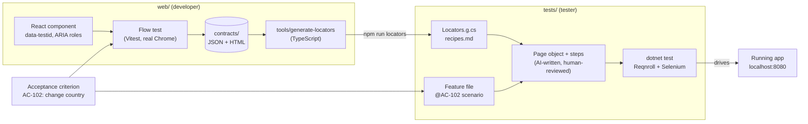

# 00 · The big picture

Read this chapter once before you build anything. Every later chapter refers back to the words defined here.

## The problem this solves

In a typical team, the web developer builds the UI and the tester writes Selenium tests against it later. The tester has to **guess**:

- Which selector finds the element? (It changed in the last release.)
- What should I wait for after I click? (The dropdown opens after an animation, and the list is rendered somewhere else in the DOM.)
- What exactly should the `Then` step check? (Text? Value? Checked state?)

Guessing produces flaky tests and long debugging sessions. The developer already knew all the answers, because they just built and tested the component, but that knowledge never reached the tester.

## The idea in one sentence

**The developer's own component test records how the UI looks and how it is operated, and writes that recording into files (UI contracts) that the tester's project turns into Selenium code.**

## The pieces



## Vocabulary

| Word | Meaning | Where it lives |
|---|---|---|
| **AC** (acceptance criterion) | One agreed business rule, with an ID such as `AC-102`. | Agreed by the team before coding |
| **Scenario** | The tester's Gherkin version of an AC, tagged `@AC-102`. | `tests/Features/*.feature` |
| **Flow test** | The developer's browser test for an AC. It drives the real component like a user would. | `web/src/pages/*.flows.browser.test.tsx` |
| **Recorder** | A small helper the flow test calls instead of clicking directly, so every step is written down. | `web/src/testing/uiContract.ts` |
| **State** | A named snapshot during a flow (`loaded`, `country-open`, `saved`). It stores the HTML plus an inventory of every visible element. | Contract JSON + `NN-name.html` |
| **Action** | Something the user does: click, fill, clear, check, uncheck, reload. | Contract JSON |
| **Wait** | A condition that must become true before continuing: an element becomes visible or hidden. | Contract JSON |
| **Outcome** | The business result to assert: a text, a value, a checked state. It becomes the `Then` step. | Contract JSON |
| **UI contract** | All of the above for one flow: `<flow-id>.contract.json` plus one HTML file per state. | `web/contracts/` |
| **Generator** | A small, deterministic TypeScript program that turns contracts into C# locators and readable recipes, and checks AC coverage. Run with `npm run locators`. | `web/tools/generate-locators/` |
| **Locators** | C# `By` fields, one per `data-testid`. Generated and never edited by hand. | `tests/Generated/*Locators.g.cs` |
| **Recipe** | A numbered, human-readable list of the recorded steps for each flow. The AI agent reads it. | `tests/Generated/*.recipes.md` |
| **Page object** | C# class with one method per user intent (`ChooseCountry("New Zealand")`). | `tests/Pages/*.cs` |
| **Step definition** | Thin C# method that connects a Gherkin sentence to a page-object method and asserts. | `tests/Steps/*.cs` |
| **bind-steps skill** | Instructions that let an AI agent (Claude Code) write page objects and step definitions from recipes. | `.claude/skills/bind-steps/SKILL.md` |

## The golden rule

> **Facts are generated, intent is written, glue is AI-assisted and human-reviewed.**

| Kind | Examples | Who produces it |
|---|---|---|
| Facts | Contracts, locators, recipes | Code (recorder, generator). Nobody edits them by hand. |
| Intent | Feature files, React components, flow tests | People |
| Glue | Page objects, step definitions | AI agent, reviewed by the tester (in this tutorial you'll write them yourself first) |

## The tools, and why each one is there

| Tool | Used for | Why this one |
|---|---|---|
| **React 19 + TypeScript** | The web app | A typical modern stack. |
| **webpack 5** | Building and serving the app on `localhost:8080` | Many existing React apps use webpack. The approach doesn't depend on it. |
| **Vitest 4 (browser mode)** | Running flow tests in a **real Chrome** | A real browser has real layout, focus and accessibility. jsdom would fake these. Vitest uses Vite internally, but only for tests. It never builds the app. |
| **Playwright (as Vitest's browser provider)** | Launching and controlling Chrome for Vitest | You never write Playwright code yourself. Vitest uses it behind `userEvent` and `page`. |
| **dom-accessibility-api** | Computing each element's ARIA role and accessible name | Browsers use the same algorithm. It gives us "Country", "Save", "New Zealand". |
| **.NET 8 + NUnit** | The test project and test runner | A typical enterprise test stack. |
| **Reqnroll 3** | Running Gherkin `.feature` files in .NET | It's the maintained successor of SpecFlow. |
| **Selenium 4** | Driving Chrome in E2E tests | The tester's existing tool. **Selenium Manager** (built in) downloads a matching chromedriver automatically. |
| **tsx** | Running the generator, a TypeScript program, with Node.js | The generator reuses the recorder's own TypeScript types, so both always agree on the contract format. It lives in `web/tools/`, next to the app's `src/` (chapter 07 explains why). |

## The example app

You'll build a **Customer profile** page with:

- a **Full name** text box (required),
- a **Country** custom dropdown (a combobox whose list is rendered in a *portal*, meaning outside the component's DOM),
- a **Subscribe to newsletter** checkbox,
- a **Save** button that shows a **"Profile saved"** toast,
- a fake backend that stores data in `localStorage`, with 300 ms of latency so tests must wait correctly.

And three agreed acceptance criteria:

| ID | Rule |
|---|---|
| AC-101 | A customer can change their full name, and it persists after reload. |
| AC-102 | A customer can change their country, and it persists after reload. |
| AC-103 | Full name is required. Saving without it shows "Full name is required". |

In chapter 12 you'll add **AC-104** (newsletter subscription) by yourself.

## Where you'll end up

```
workspace/
├── .gitignore
├── run-e2e.sh                                  ch 10
├── web/
│   ├── package.json, tsconfig.json             ch 01, 03, 07
│   ├── webpack.config.js                       ch 01
│   ├── vitest.config.ts                        ch 03
│   ├── src/
│   │   ├── index.html, main.tsx, App.tsx       ch 01, 02
│   │   ├── global.d.ts, styles.css             ch 01, 02
│   │   ├── api/seed.ts, api/customerApi.ts     ch 02
│   │   ├── components/Toast.tsx                ch 02
│   │   ├── components/CountrySelect.tsx        ch 02
│   │   ├── pages/CustomerProfilePage.tsx       ch 02
│   │   ├── pages/…flows.browser.test.tsx       ch 03, 05
│   │   └── testing/uiContract.ts               ch 04
│   ├── tools/generate-locators/                ch 07 (the generator)
│   └── contracts/                              ch 05 (generated)
└── tests/
    ├── CustomerPortal.Specs.csproj             ch 06
    ├── reqnroll.json                           ch 06
    ├── Features/CustomerProfile.feature        ch 06
    ├── Generated/                              ch 07 (generated)
    ├── Support/TestSettings.cs, UiBy.cs        ch 07
    ├── Support/Ui.cs, Hooks.cs                 ch 08
    ├── Pages/CustomerProfilePage.cs            ch 09
    └── Steps/CustomerProfileSteps.cs           ch 09
```

## Check your machine

You need these installed (macOS):

| Tool | Check | Minimum |
|---|---|---|
| Node.js | `node -v` | 20.19 |
| .NET SDK | `dotnet --list-sdks` | an 8.0.x line |
| Google Chrome | open it once | any current version |
| curl | `curl --version` | any (used by `run-e2e.sh`) |

```bash
node -v && dotnet --list-sdks && ls "/Applications/Google Chrome.app" >/dev/null && echo "Chrome OK"
```

Both test runners use **your installed Chrome**, so you don't need to download a separate browser. The first Selenium run fetches a matching chromedriver, which needs network access.

> **Port 8080.** The app runs on `http://localhost:8080`. If the sample app is also running (`sample/web`, `npm start`), stop it first. Otherwise your E2E tests will quietly run against the sample instead of your workspace.

## ✅ Checkpoint

The command above prints a Node version ≥ 20.19, an `8.0.x` SDK, and `Chrome OK`.

Next: [01 · Web project skeleton](01-web-skeleton.md)
