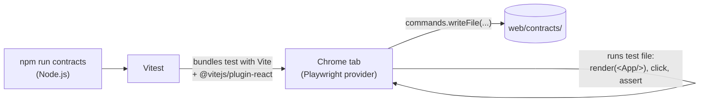

# 03 · Vitest browser mode

**Goal:** run a component test in a **real Chrome**, and understand how the tools fit together before adding the recorder.

**You'll change:** `package.json`, `tsconfig.json`. **You'll create:** `vitest.config.ts` and a first smoke test.

## 3.1 Why a real browser

Most React tests run in **jsdom**, a fake DOM inside Node.js. jsdom has no layout, so every element's size is 0 × 0. It has no real focus handling, and CSS doesn't really apply. For a *contract*, meaning a description of what a real user sees, that isn't good enough:

- "Is the listbox visible?" needs layout.
- "What is the accessible name of this button?" needs real ARIA computation.
- The portal must really render into `<body>`.

**Vitest browser mode** runs your test file *inside* a real browser tab. Vitest controls Chrome through a **provider**. We use the Playwright provider, pointed at your installed Google Chrome.



> **webpack vs Vite.** webpack builds the **app**. Vite, inside Vitest, only bundles the **tests**. Both need the same settings (the `@` alias, the React JSX transform, CSS imports), or a component could render differently in tests than in the app. Keep them in sync.

## 3.2 Install the test dependencies

```bash
(cd web && npm install -D --save-exact vitest@4.1.11 @vitest/browser-playwright@4.1.11 playwright@1.63.0 vitest-browser-react@2.3.0 @vitejs/plugin-react@5.2.0 dom-accessibility-api@0.7.1)
```

| Package | Role |
|---|---|
| `vitest` | The test runner. |
| `@vitest/browser-playwright` | The provider: Vitest uses Playwright to launch and drive Chrome. |
| `playwright` | Playwright itself. We **don't** run `npx playwright install`, because we use your installed Chrome (`channel: 'chrome'`). |
| `vitest-browser-react` | `render(<App />)` for browser mode. It mounts into a real container in the tab. |
| `@vitejs/plugin-react` | JSX transform for Vite, the counterpart of `ts-loader` in webpack. |
| `dom-accessibility-api` | Computes ARIA role and accessible name. Used by the recorder in chapter 04. |

Then add two scripts. Your `package.json` should now look like this:

**File:** `web/package.json`
```json
{
  "name": "practice-web",
  "private": true,
  "version": "0.1.0",
  "type": "module",
  "scripts": {
    "start": "webpack serve --mode development",
    "build": "webpack --mode production",
    "typecheck": "tsc --noEmit",
    "test": "vitest run",
    "contracts": "vitest run --project contracts"
  },
  "dependencies": {
    "react": "19.3.0",
    "react-dom": "19.3.0"
  },
  "devDependencies": {
    "@types/react": "19.3.0",
    "@types/react-dom": "19.3.0",
    "@vitejs/plugin-react": "5.2.0",
    "@vitest/browser-playwright": "4.1.11",
    "css-loader": "7.1.5",
    "dom-accessibility-api": "0.7.1",
    "html-webpack-plugin": "5.6.8",
    "playwright": "1.63.0",
    "style-loader": "4.0.0",
    "ts-loader": "9.6.2",
    "typescript": "5.9.3",
    "vitest": "4.1.11",
    "vitest-browser-react": "2.3.0",
    "webpack": "5.111.1",
    "webpack-cli": "6.0.1",
    "webpack-dev-server": "5.2.6"
  }
}
```

`vitest run` runs once and exits (plain `vitest` would keep watching). `--project contracts` selects the project defined in the config below.

## 3.3 Tell TypeScript about Vitest

Add `"types": ["vitest/globals"]` to `tsconfig.json`:

**File:** `web/tsconfig.json`
```json
{
  "compilerOptions": {
    "target": "ES2022",
    "module": "ESNext",
    "moduleResolution": "Bundler",
    "jsx": "react-jsx",
    "strict": true,
    "esModuleInterop": true,
    "skipLibCheck": true,
    "isolatedModules": true,
    "baseUrl": ".",
    "paths": { "@/*": ["src/*"] },
    "types": ["vitest/globals"]
  },
  "include": ["src"]
}
```

## 3.4 `vitest.config.ts`

**File:** `web/vitest.config.ts`
```ts
// Test-only bundling. Mirror anything webpack.config.js resolves (aliases, defines,
// loaders) here so components render identically in both pipelines.
import path from 'node:path';
import { defineConfig } from 'vitest/config';
import react from '@vitejs/plugin-react';
import { playwright } from '@vitest/browser-playwright';

export default defineConfig({
  plugins: [react()],
  resolve: { alias: { '@': path.resolve(import.meta.dirname, 'src') } },
  test: {
    projects: [
      {
        extends: true,
        test: {
          name: 'contracts',
          include: ['src/**/*.flows.browser.test.tsx'],
          browser: {
            enabled: true,
            headless: true,
            // Use the locally installed Google Chrome instead of downloading Playwright's Chromium.
            provider: playwright({ launchOptions: { channel: 'chrome' } }),
            instances: [{ browser: 'chromium' }],
            viewport: { width: 1280, height: 800 },
          },
        },
      },
    ],
  },
});
```

| Setting | Why |
|---|---|
| `plugins: [react()]`, `resolve.alias` | The same JSX handling and `@` alias as webpack. |
| `projects: [{ name: 'contracts', … }]` | A named group of tests. You could add a jsdom unit-test project next to it later. |
| `extends: true` | The project inherits the root `plugins` and `resolve`. |
| `include: '*.flows.browser.test.tsx'` | Only flow tests belong to this project. The naming convention is how you find them. |
| `browser.enabled/headless` | Real browser, no visible window. Set `headless: false` to watch. |
| `channel: 'chrome'` | Use installed Google Chrome. `browser: 'chromium'` is the engine family. |
| `viewport` | Fixed 1280 × 800, the same size as the Selenium window (chapter 08), so layout matches. |

## 3.5 A first smoke test

Create the flow test file with an ordinary test first. It doesn't record anything yet, but it shows the tools working. You'll replace its contents in chapter 05.

**File:** `web/src/pages/CustomerProfilePage.flows.browser.test.tsx`
```tsx
import { expect, test } from 'vitest';
import { page } from 'vitest/browser';
import { render } from 'vitest-browser-react';
import { resetStore } from '@/api/customerApi';
import { App } from '@/App';
import '@/styles.css';

test('smoke: the profile page loads the seed customer', async () => {
  resetStore();
  await render(<App />);

  // expect.element retries until the assertion passes (or times out), so no sleeps.
  await expect.element(page.getByTestId('profile-full-name')).toHaveValue('Aroha Smith');

  await page.getByTestId('profile-country').click();
  await expect.element(page.getByRole('option', { name: 'New Zealand' })).toBeVisible();
});
```

The browser-mode API you'll use everywhere:

| API | What it does |
|---|---|
| `render(<App />)` | Mounts the component into a container `<div>` in the real page. It returns `screen`, with `screen.container` and `screen.unmount()`. |
| `page.getByTestId('x')` | A **locator**: a lazy description of how to find an element. Nothing is searched until you use it. |
| `page.getByRole('option', { name: 'New Zealand' })` | Finds by ARIA role and accessible name, the way assistive technology does. |
| `expect.element(locator).toBeVisible()` | Retries until true, or fails after a timeout. This is how you **wait**. |
| `userEvent.click(locator)` / `locator.click()` | Real browser events, through Playwright. |

Notice that the smoke test has to **wait** for the name (300 ms of fake latency), and that it finds the option by role and name even though the option sits in a portal. `page.getBy…` searches the whole document.

## ✅ Checkpoint

```bash
(cd web && npm run typecheck)
(cd web && npm run contracts)
```

Expected (the timings will differ):

```
 Test Files  1 passed (1)
      Tests  1 passed (1)
```

Try this: set `headless: false` in `vitest.config.ts` and run it again. A Chrome window flashes open. Set it back to `true` afterwards.

Next: [04 · The contract recorder](04-contract-recorder.md)
