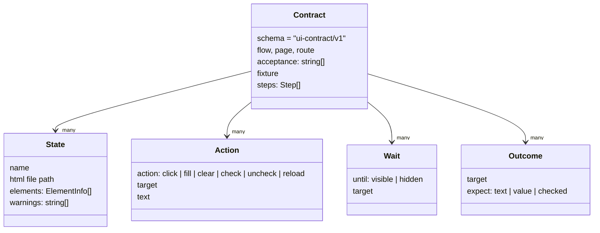

# 04 · The contract recorder

**Goal:** understand and write `uiContract.ts`, the ~200-line helper that turns a flow test into a UI contract.

**You'll create:** `web/src/testing/uiContract.ts`

This is the heart of the approach. Take your time here.

## 4.1 What it must produce

A flow test calls the recorder instead of `userEvent` directly:

```ts
const flow = recordFlow({ id: 'customer-profile.change-country', page: 'CustomerProfile', … });
await flow.state('loaded', { waitFor: profile() });   // snapshot
await flow.click(country());                            // action
await flow.state('country-open', { waitFor: listbox }); // wait + snapshot
await flow.outcome(country(), { text: 'New Zealand' }); // assertion
await flow.save();                                      // write the files
```

Each call does the real thing (clicks, waits, asserts) **and** appends a step to a list. `save()` writes the list as JSON. `state()` also writes the current HTML.

The contract's step types:



## 4.2 The full file

```bash
mkdir -p web/src/testing
```

**File:** `web/src/testing/uiContract.ts`
```ts
// Records a UI flow (state → action → state …) rendered in a real browser and
// writes it to contracts/ as JSON + HTML. The tests repository generates
// locators and step bindings from these files, so this is the hand-off point
// between the web developer and the tester.
import { commands, userEvent, type Locator } from 'vitest/browser';
import { expect } from 'vitest';
import { computeAccessibleName, getRole } from 'dom-accessibility-api';

export const CONTRACT_SCHEMA = 'ui-contract/v1';
const OUT_DIR = 'contracts';

export interface FlowOptions {
  /** Stable flow id, e.g. "customer-profile.change-country". Used as file name. */
  id: string;
  /** Logical page the flow runs on; becomes the page-object name in tests. */
  page: string;
  /** Route the E2E test must open. */
  route: string;
  /** Acceptance-criteria ids shared with the .feature file tags (e.g. "AC-102"). */
  acceptance: string[];
  /** Name of the shared fixture the flow renders with (see src/api/seed.ts). */
  fixture: string;
  /** Element the component was rendered into; anything outside it is a portal. */
  root: () => HTMLElement;
  /** Re-mounts the component to simulate a page reload (persistence checks). */
  remount?: () => Promise<void>;
}

export interface ElementInfo {
  testId: string | null;
  role: string | null;
  name: string;
  tag: string;
  inputType?: string;
  value?: string;
  text?: string;
  expanded?: boolean;
  selected?: boolean;
  checked?: boolean;
  disabled?: boolean;
  invalid?: boolean;
  /** data-testid of the element referenced by aria-controls, if any. */
  controls?: string;
  /** Rendered outside the component root (React portal). */
  portal: boolean;
  /** Repeated elements sharing one testId are grouped; data-key gives business identity. */
  repeated?: { count: number; keys: (string | null)[]; names: string[] };
}

export type Target = Pick<ElementInfo, 'testId' | 'role' | 'name'> & { key?: string | null };

export type Step =
  | { type: 'state'; name: string; html: string; elements: ElementInfo[]; warnings: string[] }
  | { type: 'wait'; until: 'visible' | 'hidden'; target: Target }
  | { type: 'action'; action: 'click' | 'fill' | 'check' | 'uncheck' | 'clear'; target: Target; text?: string }
  | { type: 'action'; action: 'reload' }
  | { type: 'outcome'; target: Target; expect: { text?: string; value?: string; checked?: boolean; visible?: boolean } };

/** One file in contracts/: <flow>.contract.json. The locator generator (tools/generate-locators) reads it. */
export interface Contract {
  schema: typeof CONTRACT_SCHEMA;
  flow: string;
  page: string;
  route: string;
  acceptance: string[];
  fixture: string;
  steps: Step[];
}

const INTERACTIVE_ROLES = new Set([
  'button', 'checkbox', 'combobox', 'link', 'listbox', 'menuitem', 'option', 'radio',
  'searchbox', 'slider', 'spinbutton', 'switch', 'tab', 'textbox', 'gridcell', 'row',
]);

function describe(el: Element, root: HTMLElement): ElementInfo {
  const html = el as HTMLElement;
  const info: ElementInfo = {
    testId: el.getAttribute('data-testid'),
    role: getRole(el),
    name: computeAccessibleName(el).trim(),
    tag: el.tagName.toLowerCase(),
    portal: !root.contains(el),
  };
  if (el instanceof HTMLInputElement) {
    info.inputType = el.type;
    if (el.type === 'checkbox' || el.type === 'radio') info.checked = el.checked;
    else info.value = el.value;
  } else if (el instanceof HTMLTextAreaElement || el instanceof HTMLSelectElement) {
    info.value = el.value;
  }
  const text = html.innerText?.trim();
  // Only leaf-level text is useful for assertions; containers would repeat their children.
  const isContainer = !!el.querySelector('[data-testid]');
  if (text && text !== info.name && text.length <= 120 && !isContainer && !(el instanceof HTMLInputElement)) info.text = text;
  const bool = (a: string) => (el.hasAttribute(a) ? el.getAttribute(a) === 'true' : undefined);
  info.expanded = bool('aria-expanded');
  info.selected = bool('aria-selected');
  info.invalid = bool('aria-invalid');
  info.disabled = (el as HTMLButtonElement).disabled || bool('aria-disabled') || undefined;
  const controls = el.getAttribute('aria-controls');
  if (controls) info.controls = document.getElementById(controls)?.getAttribute('data-testid') ?? `#${controls}`;
  for (const k of Object.keys(info) as (keyof ElementInfo)[]) if (info[k] === undefined) delete info[k];
  return info;
}

function isVisible(el: Element): boolean {
  const html = el as HTMLElement;
  return !!(html.offsetWidth || html.offsetHeight || html.getClientRects().length);
}

function inventory(root: HTMLElement) {
  const warnings: string[] = [];
  const groups = new Map<string, Element[]>();
  const untagged: Element[] = [];
  for (const el of document.body.querySelectorAll('*')) {
    if (!isVisible(el)) continue;
    const testId = el.getAttribute('data-testid');
    if (testId?.startsWith('__vitest')) continue; // test-runner container, not part of the app
    if (testId) groups.set(testId, [...(groups.get(testId) ?? []), el]);
    else if (INTERACTIVE_ROLES.has(getRole(el) ?? '')) untagged.push(el);
  }
  const elements: ElementInfo[] = [];
  for (const [testId, els] of groups) {
    const info = describe(els[0], root);
    if (els.length > 1) {
      const keys = els.map((e) => e.getAttribute('data-key'));
      info.repeated = { count: els.length, keys, names: els.map((e) => computeAccessibleName(e).trim()) };
      delete info.checked; delete info.selected; delete info.value;
      if (keys.some((k) => !k)) warnings.push(`"${testId}" is repeated ${els.length}x without data-key; rows cannot be told apart by business identity.`);
    }
    elements.push(info);
  }
  for (const el of untagged) {
    const d = describe(el, root);
    warnings.push(`Interactive ${d.role} "${d.name}" (<${d.tag}>) has no data-testid.`);
    elements.push(d);
  }
  return { elements, warnings };
}

function normalizeHtml(html: string): string {
  // Positions from portals depend on layout; they are noise for locator generation.
  return html.replace(/\sstyle="[^"]*"/g, '').replace(/\sdata-testid="__vitest_\d+__"/g, '');
}

async function toElement(locator: Locator): Promise<Element> {
  await expect.element(locator).toBeInTheDocument();
  return locator.element();
}

export function recordFlow(options: FlowOptions) {
  const steps: Step[] = [];
  let stateNo = 0;

  const target = async (locator: Locator): Promise<Target> => {
    const d = describe(await toElement(locator), options.root());
    const el = locator.element();
    return { testId: d.testId, role: d.role, name: d.name, key: el.getAttribute('data-key') ?? undefined };
  };

  return {
    /** Snapshot the current UI as a named state, optionally after waiting for an element. */
    async state(name: string, opts: { waitFor?: Locator } = {}) {
      if (opts.waitFor) {
        await expect.element(opts.waitFor).toBeVisible();
        steps.push({ type: 'wait', until: 'visible', target: await target(opts.waitFor) });
      }
      const file = `${options.id}/${String(++stateNo).padStart(2, '0')}-${name}.html`;
      await commands.writeFile(`${OUT_DIR}/${file}`, normalizeHtml(document.body.innerHTML) + '\n');
      steps.push({ type: 'state', name, html: file, ...inventory(options.root()) });
    },
    /** Click; pass `closes` when the click dismisses something (popup, dialog) the next step must wait for. */
    async click(locator: Locator, opts: { closes?: Locator } = {}) {
      const t = await target(locator);
      const closing = opts.closes ? await target(opts.closes) : null;
      await userEvent.click(locator);
      steps.push({ type: 'action', action: 'click', target: t });
      if (opts.closes && closing) {
        await expect.element(opts.closes).not.toBeInTheDocument();
        steps.push({ type: 'wait', until: 'hidden', target: closing });
      }
    },
    async fill(locator: Locator, text: string) {
      const t = await target(locator);
      await userEvent.fill(locator, text);
      steps.push({ type: 'action', action: text === '' ? 'clear' : 'fill', target: t, ...(text ? { text } : {}) });
    },
    async check(locator: Locator, checked = true) {
      const t = await target(locator);
      const el = locator.element() as HTMLInputElement;
      if (el.checked !== checked) await userEvent.click(locator);
      steps.push({ type: 'action', action: checked ? 'check' : 'uncheck', target: t });
    },
    async reload() {
      if (!options.remount) throw new Error('recordFlow: pass remount() to record a reload');
      await options.remount();
      steps.push({ type: 'action', action: 'reload' });
    },
    /** Record an observable business outcome — what a Then step should assert. */
    async outcome(locator: Locator, expected: { text?: string; value?: string; checked?: boolean }) {
      if (expected.text !== undefined) await expect.element(locator).toHaveTextContent(expected.text);
      if (expected.value !== undefined) await expect.element(locator).toHaveValue(expected.value);
      if (expected.checked !== undefined) {
        if (expected.checked) await expect.element(locator).toBeChecked();
        else await expect.element(locator).not.toBeChecked();
      }
      steps.push({ type: 'outcome', target: await target(locator), expect: { ...expected, visible: true } });
    },
    async save() {
      const contract: Contract = {
        schema: CONTRACT_SCHEMA,
        flow: options.id,
        page: options.page,
        route: options.route,
        acceptance: options.acceptance,
        fixture: options.fixture,
        steps,
      };
      await commands.writeFile(`${OUT_DIR}/${options.id}.contract.json`, JSON.stringify(contract, null, 2) + '\n');
    },
  };
}
```

## 4.3 Walkthrough

### Imports

- `commands.writeFile` is the key trick. The test runs **inside Chrome**, which can't write to your disk. `commands` are small functions that Vitest runs back in **Node.js**, where writing files is allowed. Paths are relative to the project root, so files go to `web/contracts/`.
- `userEvent` and `Locator` come from Vitest browser mode.
- `getRole` and `computeAccessibleName` implement the W3C accessibility rules. `computeAccessibleName` is why the country button's name is "Country": it follows `aria-labelledby` to the `<span>`.

### Types

- `FlowOptions`: everything a flow declares about itself. `acceptance` links it to the `@AC-nnn` scenario. `page` becomes the C# class name prefix (`CustomerProfileLocators`). `root` is the container React rendered into, which is how portals are detected.
- `ElementInfo`: what the recorder writes about each element. Optional properties are **deleted when undefined** (last line of `describe`), so the JSON only contains facts that apply.
- `Target`: a short reference to an element, used inside actions, waits and outcomes.
- `Step`: a discriminated union on `type`. Chapter 07's generator switches on the same field.
- `Contract`: the shape of the whole `<flow>.contract.json` file, used by `save()`. `Target`, `Step` and `Contract` are **exported** so that the locator generator (chapter 07) can import the very same types. If the recorder's format changes, the generator stops compiling instead of silently misreading contracts.

### `describe(el, root)`: facts about one element

| Fact | Source | Used for |
|---|---|---|
| `testId` | `data-testid` | The locator |
| `role`, `name` | Accessibility API | Doc comments, and matching Gherkin values to names |
| `portal` | `!root.contains(el)` | Warns that the element is outside the component |
| `value` / `checked` | Input state | What a `Then` step can read |
| `text` | `innerText`, **only for leaves** (no child test IDs, ≤ 120 chars, differs from name) | Assertions on text |
| `expanded`, `selected`, `invalid`, `disabled` | ARIA attributes | Shows state changes between snapshots |
| `controls` | `aria-controls` → that element's test ID | Links combobox → listbox |

### `inventory(root)`: every visible element in a state

1. Walk **all** of `document.body`, not just `root`. Otherwise portals would be missed.
2. Skip invisible elements (no size and no layout boxes).
3. Skip Vitest's own container (`__vitest…`).
4. Group elements by test ID. More than one element with the same test ID is a **repeated** element: record `count`, the `data-key` of each, and each name. A missing `data-key` produces a **warning**.
5. Any interactive element (by role) **without** a test ID produces a **warning**. The tester can't locate it reliably, so the developer must add one.

Warnings flow all the way through: contract → recipe (⚠) → the AI agent is told to stop on them.

### `normalizeHtml`

This removes `style="…"` (portal positions vary with layout) and Vitest's container ID. The goal: **the same UI gives byte-identical files on every run**, so a contract diff in a pull request always means a real UI change.

### `recordFlow(options)`: the API

| Method | Does | Records |
|---|---|---|
| `state(name, { waitFor })` | Waits until `waitFor` is visible, writes `NN-name.html`, takes the inventory | `wait: visible` (if `waitFor`) + `state` |
| `click(loc, { closes })` | Clicks. If `closes` is given, waits until that element is gone | `action: click` (+ `wait: hidden`) |
| `fill(loc, text)` | Types text. Empty text means clear | `action: fill` with `text`, or `action: clear` |
| `check(loc, checked)` | Clicks only if the state must change | `action: check` / `uncheck` |
| `reload()` | Unmounts and remounts the app (the flow's `remount`). `localStorage` survives, just like a real reload | `action: reload` |
| `outcome(loc, expected)` | **Asserts**, and fails the test if wrong | `outcome` with `expect` |
| `save()` | Writes `<id>.contract.json` | — |

Two details worth noticing:

- `target()` is called **before** the click. After a click the element may be gone (an option in a closed listbox), so its facts are captured while it still exists.
- `outcome()` asserts first and records second, and the JSON is only written by `save()` at the very end. So the contract JSON only ever contains outcomes that **really happened** in a real browser.
- One caveat: `state()` writes its HTML file **immediately**. If a flow fails halfway, the HTML files of the states it did reach are already overwritten, while the JSON still describes the previous, good run. Only commit `contracts/` after a green run. Chapter 11, Lab 2 shows this happening.

## ✅ Checkpoint

```bash
(cd web && npm run typecheck)   # no errors
(cd web && npm run contracts)   # the smoke test still passes
```

Nothing uses the recorder yet. That's the next chapter.

Next: [05 · Flow tests and contracts](05-flow-tests.md)
