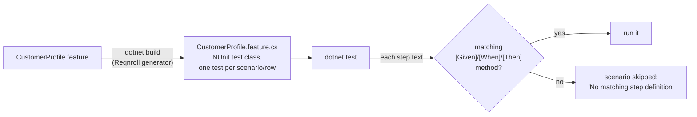

# 06 · The test project

**Goal:** a .NET 8 Reqnroll project containing the tester's feature file. It builds and runs, and every scenario is skipped with "No matching step definition found".

**You'll create:** `tests/CustomerPortal.Specs.csproj`, `tests/reqnroll.json`, `tests/Features/CustomerProfile.feature`

The tester usually does this part **in parallel** with the developer's chapters 02–05. Both sides only need the agreed AC IDs.

## 6.1 The project file

```bash
mkdir -p tests/Features
```

**File:** `tests/CustomerPortal.Specs.csproj`
```xml
<Project Sdk="Microsoft.NET.Sdk">

  <PropertyGroup>
    <TargetFramework>net8.0</TargetFramework>
    <Nullable>enable</Nullable>
    <ImplicitUsings>enable</ImplicitUsings>
    <IsPackable>false</IsPackable>
    <RootNamespace>CustomerPortal.Specs</RootNamespace>
  </PropertyGroup>

  <ItemGroup>
    <PackageReference Include="Microsoft.NET.Test.Sdk" Version="17.14.1" />
    <PackageReference Include="NUnit" Version="4.3.2" />
    <PackageReference Include="NUnit3TestAdapter" Version="5.0.0" />
    <PackageReference Include="Reqnroll.NUnit" Version="3.3.4" />
    <PackageReference Include="Selenium.WebDriver" Version="4.49.0" />
  </ItemGroup>

  <ItemGroup>
    <!-- Recipes are inputs for the binding agent, not compiled code. -->
    <None Include="Generated\*.recipes.md" />
  </ItemGroup>

</Project>
```

| Package | Role |
|---|---|
| `Microsoft.NET.Test.Sdk` | Makes `dotnet test` work for this project. |
| `NUnit` + `NUnit3TestAdapter` | Test framework, and the adapter that lets `dotnet test` find NUnit tests (the adapter also supports NUnit 4). |
| `Reqnroll.NUnit` | Reqnroll runtime plus a **build step** that turns each `.feature` file into a C# NUnit test class. |
| `Selenium.WebDriver` | Browser automation. It includes **Selenium Manager**, which finds your Chrome and downloads a matching chromedriver. |

- `ImplicitUsings` adds `System`, `System.IO`, `System.Linq` and similar, so the files stay short.
- `RootNamespace` is the base namespace. Folders add to it (`CustomerPortal.Specs.Support`, `.Pages`, `.Steps`, `.Generated`).
- `<None Include="Generated\*.recipes.md" />` shows the recipes in IDEs without compiling them. `Generated/*.g.cs` is compiled automatically, like any `.cs` file.

## 6.2 Reqnroll configuration

**File:** `tests/reqnroll.json`
```json
{
  "$schema": "https://schemas.reqnroll.net/reqnroll-config-latest.json",
  "language": { "feature": "en-US" },
  "bindingAssemblies": []
}
```

The defaults are fine. `bindingAssemblies: []` means step definitions are only looked up in this project.

## 6.3 The feature file

**File:** `tests/Features/CustomerProfile.feature`
```gherkin
Feature: Customer profile
  As a customer
  I want to keep my profile details up to date
  So that my account information is correct

  # Owned by the tester. Tags @AC-nnn link each scenario to the acceptance
  # criterion and to the web flow test that produced its UI contract.

  Background:
    Given I am on my customer profile

  @AC-101
  Scenario: Update my full name
    When I change my full name to "Aroha Ngata"
    And I save my profile
    Then I see the confirmation "Profile saved"
    And after reloading the page my full name is "Aroha Ngata"

  @AC-102
  Scenario Outline: Change my country
    When I choose "<country>" as my country
    And I save my profile
    Then I see the confirmation "Profile saved"
    And after reloading the page my country is "<country>"

    Examples:
      | country        |
      | New Zealand    |
      | United Kingdom |

  @AC-103
  Scenario: Full name is required
    When I clear my full name
    And I save my profile
    Then I see the error "Full name is required"
```

How the tester writes it:

- **Business language only.** "I choose … as my country", not "I click the dropdown and select …". The UI may change from a dropdown to radio buttons, but the scenario stays the same.
- **`Background`** runs before every scenario in the file.
- **`@AC-nnn` tags** are the link to the developer's flow tests. Reqnroll also turns each tag into an **NUnit category**, so `dotnet test --filter Category=AC-102` runs just that AC.
- **`Scenario Outline` + `Examples`** runs the scenario once per row. Note that **United Kingdom was never recorded** by the developer's flow, which recorded New Zealand. Chapter 09 shows why that still works.
- **Quoted values** (`"Aroha Ngata"`) become `{string}` parameters in step definitions.

## 6.4 How Reqnroll runs a feature file



`Features/CustomerProfile.feature.cs` appears after the first build. It's generated, and `.gitignore` excludes it. Don't edit it.

## ✅ Checkpoint

```bash
(cd tests && dotnet test)
```

The first run restores NuGet packages, which can take a minute. Expected:

```
  Skipped ChangeMyCountry("New Zealand","1",null)
  Skipped ChangeMyCountry("United Kingdom","2",null)
  Skipped FullNameIsRequired
  Skipped UpdateMyFullName
None     - Failed:     0, Passed:     0, Skipped:     0, Total:     0, …
```

Four tests (three scenarios, and the outline counts twice), all skipped. The exit code is 0.

Don't be confused by the last line. A scenario with missing steps is recorded as *not executed*: the per-test lines show it as `Skipped`, but the summary line only counts tests that ran, so it says `None … Total: 0`. The per-test lines are the ones to read. To see why, and what code Reqnroll suggests:

```bash
(cd tests && dotnet test --no-build --filter Category=AC-103 --logger "console;verbosity=detailed")
```

```
  Error Message:
   No matching step definition found for one or more steps.
   …
        [Given("I am on my customer profile")]
        public void GivenIAmOnMyCustomerProfile()
        {
            throw new PendingStepException();
        }
```

The spec exists but nothing is bound yet. That's the starting point for chapters 07–09.

Next: [07 · The locator generator](07-generator.md)
