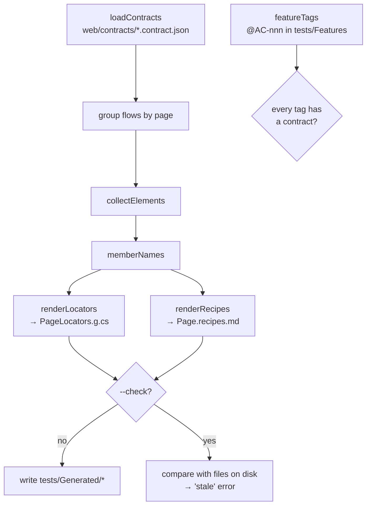

# 07 · The locator generator

**Goal:** turn `web/contracts/` into C# locators and readable recipes **with a program**, and check AC coverage.

**You'll create:** `tests/Support/TestSettings.cs`, `tests/Support/UiBy.cs`, and the generator `web/tools/generate-locators/` (5 TypeScript files plus a `tsconfig.json`). **You'll change:** `web/package.json`. **Generated:** `tests/Generated/CustomerProfileLocators.g.cs`, `tests/Generated/CustomerProfile.recipes.md`

## 7.1 Why a program and not AI

A locator is a **fact**: `data-testid="profile-save"` either is on the Save button or it isn't. Facts should be copied, not interpreted.

| | Program | AI |
|---|---|---|
| Same input, same output | always | not guaranteed |
| Reviewable diffs | yes, only real changes | noisy |
| Can fail CI on drift | yes (`--check`) | no |
| Good at "choose country" → open, pick, wait for close | no | **yes** |

So the program handles the facts, and AI handles the meaning (chapter 09).

## 7.2 Two small support files first

The generated code refers to `UiBy`, so create the support files first. Otherwise the test project won't compile after generating.

```bash
mkdir -p tests/Support
```

**File:** `tests/Support/UiBy.cs`
```csharp
using OpenQA.Selenium;

namespace CustomerPortal.Specs.Support;

/// <summary>Locator conventions agreed with the web team (see docs/conventions.md).</summary>
public static class UiBy
{
    public static By TestId(string testId) => By.CssSelector($"[data-testid='{testId}']");

    /// <summary>One item of a repeated element, identified by its business key (data-key).</summary>
    public static By TestIdWithKey(string testId, string key) =>
        By.CssSelector($"[data-testid='{testId}'][data-key='{key}']");
}
```

These two methods are the **only** ways the tests locate elements, and they match the web conventions from chapter 02 exactly. A `By.CssSelector` searches from the document root, so portal elements are found without doing anything special.

**File:** `tests/Support/TestSettings.cs`
```csharp
namespace CustomerPortal.Specs.Support;

public static class TestSettings
{
    public static Uri BaseUrl { get; } = new(Environment.GetEnvironmentVariable("WEB_BASE_URL") ?? "http://localhost:8080");

    /// <summary>Set HEADED=1 to watch the browser.</summary>
    public static bool Headless { get; } = Environment.GetEnvironmentVariable("HEADED") != "1";

    public static TimeSpan Timeout { get; } = TimeSpan.FromSeconds(10);
}
```

Settings come from environment variables, so CI can point at another URL without code changes. `Timeout` is the longest any wait can take before a test fails.

## 7.3 Where the generator lives, and why

The generator is a small **TypeScript program inside the web project**, in `web/tools/generate-locators/`. It reads `web/contracts/` and the tester's feature files, and writes into the tests project:

```
workspace/
├── web/
│   ├── src/testing/uiContract.ts    the recorder: defines the contract types
│   ├── contracts/                   written by the flow tests
│   └── tools/generate-locators/     reads contracts + ../tests/Features, writes ../tests/Generated
└── tests/
    ├── Features/                    read (for @AC-nnn coverage)
    └── Generated/                   written: locators + recipes
```

Why here:

- **One source of truth for the format.** The recorder (chapter 04) exports its `Contract`, `Step` and `ElementInfo` types. The generator imports those exact types, so if the recorder's format changes, `npm run typecheck` fails right away instead of the generator silently misreading contracts.
- **One toolchain.** Node and npm are already there for the web app, so there's no extra language or project to install.
- **Outside `src/`.** `src/` is the browser app that webpack bundles. The generator is a Node.js program (it reads and writes files), so it lives next to `src/`, not inside it, and it gets its own TypeScript settings with Node's types.

**Who runs it:** usually the tester, after pulling the developer's contracts, and CI. It lives in `web/` because of the shared types, but its output belongs to the tests project.

## 7.4 Two new dev dependencies and three scripts

Node.js 20 can't run `.ts` files directly, so we add **tsx**, a small runner that strips the types and runs the file. We also need **@types/node**, the type definitions for Node's `fs` and `path` modules.

```bash
(cd web && npm install -D --save-exact tsx@4.23.15 @types/node@20.19.43)
```

Then update the scripts. Your `package.json` should now look like this:

**File:** `web/package.json`
```json
{
  "name": "practice-web",
  "private": true,
  "version": "0.1.0",
  "type": "module",
  "scripts": {
    "start": "webpack serve --mode development",
    "build": "webpack --mode production",
    "typecheck": "tsc --noEmit && tsc --noEmit -p tools",
    "test": "vitest run",
    "contracts": "vitest run --project contracts",
    "locators": "tsx tools/generate-locators/main.ts",
    "locators:check": "tsx tools/generate-locators/main.ts --check"
  },
  "dependencies": {
    "react": "19.3.0",
    "react-dom": "19.3.0"
  },
  "devDependencies": {
    "@types/node": "20.19.43",
    "@types/react": "19.3.0",
    "@types/react-dom": "19.3.0",
    "@vitejs/plugin-react": "5.2.0",
    "@vitest/browser-playwright": "4.1.11",
    "css-loader": "7.1.5",
    "dom-accessibility-api": "0.7.1",
    "html-webpack-plugin": "5.6.8",
    "playwright": "1.63.0",
    "style-loader": "4.0.0",
    "ts-loader": "9.6.2",
    "tsx": "4.23.15",
    "typescript": "5.9.3",
    "vitest": "4.1.11",
    "vitest-browser-react": "2.3.0",
    "webpack": "5.111.1",
    "webpack-cli": "6.0.1",
    "webpack-dev-server": "5.2.6"
  }
}
```

| Script | What it does |
|---|---|
| `typecheck` | Now checks two TypeScript projects: the app (`tsconfig.json`, browser code in `src/`) and the tools (`tools/tsconfig.json`, Node code). |
| `locators` | Runs the generator and writes `../tests/Generated/*`. |
| `locators:check` | Same, but writes nothing and fails if `../tests/Generated` is out of date. This is for CI. |

## 7.5 TypeScript settings for the tools

```bash
mkdir -p web/tools/generate-locators
```

**File:** `web/tools/tsconfig.json`
```json
{
  "extends": "../tsconfig.json",
  "compilerOptions": { "types": ["node"] },
  "include": ["."]
}
```

- `extends` reuses every setting from `web/tsconfig.json` (strict mode, module resolution, …).
- `types: ["node"]` makes Node's globals and modules (`node:fs`, `node:path`, `process`) known, **only here**. The app's own `tsconfig.json` stays browser-only, so app code can't accidentally use `fs`.
- `include: ["."]` means everything in `web/tools/`. The app's `tsconfig.json` only includes `src`, so webpack and the app typecheck never see the tools.

## 7.6 Reading contracts

**File:** `web/tools/generate-locators/contracts.ts`
```ts
// Reads web/contracts/*.contract.json. The types come from the recorder itself
// (src/testing/uiContract.ts), so the recorder and the generator can't drift apart.
import fs from 'node:fs';
import path from 'node:path';
import type { Contract } from '../../src/testing/uiContract';

// A type-only import is erased at runtime, so the schema id is repeated here;
// the type annotation still fails the typecheck if the recorder's id changes.
export const SUPPORTED_SCHEMA: Contract['schema'] = 'ui-contract/v1';

/** A "stop with this message" error; main.ts prints it and exits with code 1. */
export class GeneratorError extends Error {}

/** Every *.contract.json in the folder, sorted by file name so the output is stable. */
export function loadContracts(dir: string): Contract[] {
  const files = fs.existsSync(dir) ? fs.readdirSync(dir).filter((f) => f.endsWith('.contract.json')).sort() : [];
  if (files.length === 0) throw new GeneratorError(`No contracts found in ${dir}. Run \`npm run contracts\` first.`);
  return files.map((file) => {
    const contract = JSON.parse(fs.readFileSync(path.join(dir, file), 'utf8')) as Contract;
    if (contract.schema !== SUPPORTED_SCHEMA)
      throw new GeneratorError(`${file}: unsupported schema '${contract.schema}', expected ${SUPPORTED_SCHEMA}`);
    return contract;
  });
}
```

| Piece | What to understand |
|---|---|
| `import type { Contract } …` | Imports only the **types** from the recorder. `import type` is erased when the code runs, which matters: the recorder's module also imports `vitest/browser`, which can only run inside a browser test. |
| `SUPPORTED_SCHEMA: Contract['schema']` | The id has to be repeated as a value (types don't exist at runtime), but the type annotation ties it to the recorder: if `CONTRACT_SCHEMA` there changes, this line stops compiling. |
| `.sort()` | Files are read in name order, so the output is the same on every machine. |
| Schema check | An unknown `schema` stops the generator with a clear message. |
| `GeneratorError` | A "stop with this message" error. `main.ts` prints it and exits with code 1. |

## 7.7 Member names

**File:** `web/tools/generate-locators/naming.ts`
```ts
/** "full-name" → "FullName". */
export function pascal(text: string): string {
  return text
    .split(/[^A-Za-z0-9]+/)
    .filter((part) => part.length > 0)
    .map((part) => part[0].toUpperCase() + part.slice(1))
    .join('');
}

/**
 * C# member name per test id. The page's most common prefix is stripped:
 * profile-country → Country, profile-save → Save, toast → Toast.
 */
export function memberNames(testIds: string[]): Map<string, string> {
  const counts = new Map<string, number>(); // a Map keeps first-seen order
  for (const id of testIds) {
    const first = id.split('-')[0];
    counts.set(first, (counts.get(first) ?? 0) + 1);
  }
  // Highest count wins; on a tie, the prefix seen first.
  let prefix = '';
  let count = 0;
  for (const [p, c] of counts) if (c > count) [prefix, count] = [p, c];

  const names = new Map<string, string>();
  for (const id of testIds) {
    const rest = count > 1 && id.startsWith(`${prefix}-`) ? id.slice(prefix.length + 1) : id;
    names.set(id, pascal(rest) || pascal(id));
  }
  return names;
}
```

`memberNames` finds the most common first segment of the page's test IDs (`profile`) and strips it: `profile-full-name-error` → `FullNameError`. `toast` has a different prefix, so it stays `Toast`. That's why the conventions ask for a page prefix on every test ID except global widgets. A `Map` remembers insertion order, which makes the tie-break (first prefix seen wins) predictable.

## 7.8 The locator class

**File:** `web/tools/generate-locators/locators.ts`
```ts
import type { Contract, ElementInfo } from '../../src/testing/uiContract';

/** An element as seen across all states of all flows of one page. */
export interface SeenElement {
  info: ElementInfo; // facts from the first state it was seen in
  states: string[]; // "flow#state" for every state it was seen in
  repeated?: { keys: (string | null)[]; names: string[] }; // merged over all states
}

/** Union of every element seen in any state of any flow, keyed by testId (first-seen order). */
export function collectElements(flows: Contract[]): Map<string, SeenElement> {
  const elements = new Map<string, SeenElement>();
  for (const flow of flows) {
    for (const step of flow.steps) {
      if (step.type !== 'state') continue;
      for (const e of step.elements) {
        if (!e.testId) continue;
        let seen = elements.get(e.testId);
        if (!seen) elements.set(e.testId, (seen = { info: e, states: [] }));
        seen.states.push(`${flow.flow}#${step.name}`);
        if (e.repeated) {
          seen.repeated ??= { keys: [], names: [] };
          addDistinct(seen.repeated.keys, e.repeated.keys);
          addDistinct(seen.repeated.names, e.repeated.names);
        }
      }
    }
  }
  return elements;
}

/** One C# class with a By per test id, sorted, with the recorded facts as doc comments. */
export function renderLocators(
  page: string,
  route: string,
  elements: Map<string, SeenElement>,
  names: Map<string, string>,
): string {
  const lines = [
    '// <auto-generated>',
    '//   Generated by web/tools/generate-locators from web/contracts. Do not edit.',
    '//   Change the React component + flow test, then regenerate.',
    '// </auto-generated>',
    'using OpenQA.Selenium;',
    'using CustomerPortal.Specs.Support;',
    '',
    'namespace CustomerPortal.Specs.Generated;',
    '',
    `public static class ${page}Locators`,
    '{',
    `    public const string Route = "${route}";`,
  ];
  for (const testId of [...elements.keys()].sort()) {
    const { info: e, states, repeated } = elements.get(testId)!;
    const member = names.get(testId)!;

    const facts = [`role=${e.role ?? '(none)'}`];
    if (!repeated) facts.push(`name="${e.name}"`);
    facts.push(`tag=${e.tag}`);
    if (e.portal) facts.push('PORTAL: rendered outside the component, search from document root');
    if (e.controls) facts.push(`controls=${e.controls}`);

    const seenIn = [...new Set(states)].sort();
    let remarks = `Seen in: ${seenIn.slice(0, 6).join(', ')}${seenIn.length > 6 ? ' …' : ''}`;
    if (repeated) {
      const keys = repeated.keys.map((k) => k || '(none)').join(', ');
      remarks = `Repeated; pick one by data-key or accessible name. Keys: ${keys}. Names: ${repeated.names.join(', ')}. ${remarks}`;
    }

    lines.push('', `    /// <summary>${facts.join('; ')}</summary>`, `    /// <remarks>${remarks}</remarks>`);
    if (repeated) {
      lines.push(`    public static readonly By ${member}s = By.CssSelector("[data-testid='${testId}']");`);
      lines.push(`    public static By ${member}(string key) => UiBy.TestIdWithKey("${testId}", key);`);
    } else {
      lines.push(`    public static readonly By ${member} = UiBy.TestId("${testId}");`);
    }
  }
  lines.push('}');
  return lines.join('\n') + '\n';
}

function addDistinct<T>(target: T[], items: T[]) {
  for (const item of items) if (!target.includes(item)) target.push(item);
}
```

| Part | What to understand |
|---|---|
| `collectElements` | An element may only appear in one state (the listbox only in `country-open`). Taking the union over **all states of all flows** gives one complete locator class per page. For repeated elements, keys and names are merged. Note `step.type !== 'state'`: after that check TypeScript knows `step` is a state step and allows `step.elements`. |
| Sorted by test ID | So the file is stable and diffs are small. |
| Doc comments | Carry the facts: role, name, tag, **PORTAL**, `controls`, and where the element was seen. Your C# IDE shows them when you hover over `L.CountryListbox`. |
| Repeated elements | Get **two** members: `CountryOptions` (all of them) and `CountryOption("NZ")` (one, by business key). |

## 7.9 The recipes

**File:** `web/tools/generate-locators/recipes.ts`
```ts
import type { Contract, Step, Target } from '../../src/testing/uiContract';

/** One numbered list per flow; targets are written as locator member names. */
export function renderRecipes(page: string, flows: Contract[], names: Map<string, string>): string {
  const lines = [
    `# ${page} flow recipes`,
    '',
    '<!-- Generated by web/tools/generate-locators from web/contracts. Do not edit. -->',
    '',
    'Each recipe is the exact interaction the web developer verified in a real browser.',
    `Member names refer to \`${page}Locators\`. Waits are observable conditions, never sleeps.`,
  ];
  for (const flow of flows) {
    lines.push(
      '',
      `## ${flow.flow}`,
      '',
      `- Acceptance: ${flow.acceptance.map((ac) => `@${ac}`).join(', ')}`,
      `- Route: \`${flow.route}\` · Fixture: \`${flow.fixture}\``,
      '',
    );
    flow.steps.forEach((step, i) => lines.push(`${i + 1}. ${describeStep(step, names)}`));
  }
  return lines.join('\n') + '\n';
}

function describeStep(s: Step, names: Map<string, string>): string {
  switch (s.type) {
    case 'state':
      return `_state_ **${s.name}** (\`${s.html}\`)${s.warnings.length > 0 ? ` ⚠ ${s.warnings.join('; ')}` : ''}`;
    case 'wait':
      return `wait until \`${targetRef(s.target, names)}\` is ${s.until}`;
    case 'action':
      if (s.action === 'reload') return 'reload the page';
      return `${s.action} \`${targetRef(s.target, names)}\`${s.text ? ` with "${s.text}"` : ''}`;
    case 'outcome': {
      // The recorder's own "visible" flag is implied by the wait before it.
      const expected = Object.entries(s.expect)
        .filter(([key]) => key !== 'visible')
        .map(([key, value]) => `${key}=${JSON.stringify(value)}`)
        .join(', ');
      return `**assert** \`${targetRef(s.target, names)}\` ${expected}`;
    }
  }
}

function targetRef(target: Target, names: Map<string, string>): string {
  if (!target.testId) return `/* no data-testid: role=${target.role ?? '(none)'} name="${target.name}" */`;
  const member = names.get(target.testId) ?? '?';
  return target.key ? `${member}("${target.key}")  // name "${target.name}"` : member;
}
```

One numbered list per flow. Targets are written as **locator member names** (`CountryListbox`, `CountryOption("NZ")`), so every recipe line maps directly to C#. The `switch (s.type)` covers every kind of `Step`. Because `Step` is the recorder's own union type, adding a new step kind to the recorder makes this function fail to compile until the recipe knows how to describe it. A missing test ID shows up as `/* no data-testid … */` and a recorder warning as `⚠`, and both tell the agent to stop.

## 7.10 The program

**File:** `web/tools/generate-locators/main.ts`
```ts
// Generates Selenium locators and flow recipes for the tests project from the UI contracts.
//
// Deterministic on purpose: locators are facts copied from the rendered UI, so they
// are generated by code, not by an AI. The AI agent works one level up, mapping
// Gherkin steps to flows using the files written here.
//
//   npm run locators          # write ../tests/Generated/*
//   npm run locators:check    # CI: fail if stale or AC coverage gaps
import fs from 'node:fs';
import path from 'node:path';
import { GeneratorError, loadContracts } from './contracts';
import { collectElements, renderLocators } from './locators';
import { memberNames } from './naming';
import { renderRecipes } from './recipes';

const WEB_DIR = path.resolve(import.meta.dirname, '../..');
const CONTRACTS_DIR = path.join(WEB_DIR, 'contracts');
const TESTS_DIR = path.resolve(WEB_DIR, '../tests'); // the tests project sits next to web/
const OUT_DIR = path.join(TESTS_DIR, 'Generated');
const FEATURES_DIR = path.join(TESTS_DIR, 'Features');

try {
  process.exitCode = run(process.argv.includes('--check'));
} catch (e) {
  if (!(e instanceof GeneratorError)) throw e;
  console.error(e.message);
  process.exitCode = 1;
}

function run(check: boolean): number {
  if (!fs.existsSync(TESTS_DIR)) throw new GeneratorError(`Expected the tests project at ${TESTS_DIR}.`);

  // 1. Read contracts and render one locator class + one recipe file per page.
  const flows = loadContracts(CONTRACTS_DIR);
  const outputs = new Map<string, string>();
  for (const [page, pageFlows] of groupBy(flows, (f) => f.page)) {
    const routes = [...new Set(pageFlows.map((f) => f.route))];
    if (routes.length !== 1) throw new GeneratorError(`${page}: flows disagree on route ${routes.join(', ')}`);
    const elements = collectElements(pageFlows);
    const names = memberNames([...elements.keys()]);
    outputs.set(path.join(OUT_DIR, `${page}Locators.g.cs`), renderLocators(page, routes[0], elements, names));
    outputs.set(path.join(OUT_DIR, `${page}.recipes.md`), renderRecipes(page, pageFlows, names));
  }

  // 2. Recorder warnings (missing data-testid / data-key) are passed on.
  const warnings = flows.flatMap((f) =>
    f.steps.flatMap((s) => (s.type === 'state' ? s.warnings.map((w) => `${f.flow}#${s.name}: ${w}`) : [])),
  );
  const problems: string[] = [];

  // 3. Coverage: every @AC-nnn tag in the feature files needs a contract, and vice versa.
  const tags = featureTags();
  const covered = new Set(flows.flatMap((f) => f.acceptance));
  for (const ac of [...tags.keys()].sort())
    if (!covered.has(ac))
      problems.push(`${ac} (${tags.get(ac)!.join(', ')}) has no UI contract; ask the web developer for a flow test.`);
  for (const ac of [...covered].filter((ac) => !tags.has(ac)).sort())
    warnings.push(`${ac} has a UI contract but no scenario tagged @${ac}.`);

  // 4. Write the files, or (--check) only compare them with what is on disk.
  if (check) {
    for (const [file, text] of outputs)
      if (!fs.existsSync(file) || fs.readFileSync(file, 'utf8') !== text)
        problems.push(`${relative(file)} is stale; run \`npm run locators\` in web/ and commit.`);
  } else {
    fs.mkdirSync(OUT_DIR, { recursive: true });
    for (const [file, text] of outputs) {
      fs.writeFileSync(file, text);
      console.log(`wrote ${relative(file)}`);
    }
  }

  for (const w of warnings) console.log(`warning: ${w}`);
  for (const p of problems) console.error(`error: ${p}`);
  const coveredTags = [...covered].filter((ac) => tags.has(ac)).length;
  console.log(`${flows.length} flows, ${coveredTags}/${tags.size} tagged acceptance criteria covered`);
  return problems.length > 0 ? 1 : 0;
}

/** @AC-nnn tag → the "file:line" places it appears, e.g. "Features/CustomerProfile.feature:12". */
function featureTags(): Map<string, string[]> {
  const tags = new Map<string, string[]>();
  if (!fs.existsSync(FEATURES_DIR)) return tags;
  const files = fs
    .readdirSync(FEATURES_DIR, { recursive: true, encoding: 'utf8' })
    .filter((f) => f.endsWith('.feature'))
    .sort();
  for (const file of files) {
    const lines = fs.readFileSync(path.join(FEATURES_DIR, file), 'utf8').split('\n');
    lines.forEach((line, i) => {
      for (const match of line.matchAll(/@(AC-\d+)\b/g)) {
        const where = tags.get(match[1]) ?? [];
        where.push(`${relative(path.join(FEATURES_DIR, file))}:${i + 1}`);
        tags.set(match[1], where);
      }
    });
  }
  return tags;
}

/** Path relative to tests/ with forward slashes, e.g. "Generated/CustomerProfileLocators.g.cs". */
function relative(file: string): string {
  return path.relative(TESTS_DIR, file).split(path.sep).join('/');
}

function groupBy<T>(items: T[], key: (item: T) => string): Map<string, T[]> {
  const groups = new Map<string, T[]>();
  for (const item of items) groups.set(key(item), [...(groups.get(key(item)) ?? []), item]);
  return groups;
}
```



| Step | What to understand |
|---|---|
| Paths | Everything is resolved from the file's own location (`import.meta.dirname`), with `tests/` as the sibling of `web/`. It doesn't matter which folder you start it from. |
| 2. warnings | Recorder warnings (missing `data-testid`, missing `data-key`) are repeated here, so the tester sees them without opening JSON. |
| 3. coverage | A tag without a contract is an **error**: the tester is ahead and the developer owes a flow. A contract without a tag is a **warning**. |
| 4. `--check` | For CI. It writes nothing and fails if `tests/Generated` differs from what would be generated. That catches "contracts changed but nobody regenerated". |
| Exit code | `process.exitCode` is `0` if everything is OK and `1` on any problem, so scripts and CI can stop. |

## 7.11 Run it

```bash
(cd web && npm run typecheck)
(cd web && npm run locators)
```

The typecheck prints only npm's headers. The generator prints (after npm's two-line `> tsx tools/generate-locators/main.ts` header):

```
wrote Generated/CustomerProfileLocators.g.cs
wrote Generated/CustomerProfile.recipes.md
3 flows, 3/3 tagged acceptance criteria covered
```

Paths are shown relative to `tests/`.

### Read the locators

Open `tests/Generated/CustomerProfileLocators.g.cs`. Here's a part of it:

```csharp
public static class CustomerProfileLocators
{
    public const string Route = "/";

    /// <summary>role=combobox; name="Country"; tag=button</summary>
    public static readonly By Country = UiBy.TestId("profile-country");

    /// <summary>role=listbox; name="Country"; tag=ul; PORTAL: rendered outside the component, search from document root</summary>
    public static readonly By CountryListbox = UiBy.TestId("profile-country-listbox");

    /// <remarks>Repeated; pick one by data-key or accessible name. Keys: AU, CA, NZ, GB, US. Names: Australia, Canada, New Zealand, United Kingdom, United States. …</remarks>
    public static readonly By CountryOptions = By.CssSelector("[data-testid='profile-country-option']");
    public static By CountryOption(string key) => UiBy.TestIdWithKey("profile-country-option", key);
    …
}
```

The `Names:` list is how you'll know that "United Kingdom", used in the Scenario Outline but never clicked in a flow, exists in the fixture.

### Read the recipes

Open `tests/Generated/CustomerProfile.recipes.md`. AC-102 reads:

```
1. wait until `Page` is visible
2. _state_ **loaded** (…/01-loaded.html)
3. click `Country`
4. wait until `CountryListbox` is visible
5. _state_ **country-open** (…/02-country-open.html)
6. click `CountryOption("NZ")  // name "New Zealand"`
7. wait until `CountryListbox` is hidden
8. _state_ **country-selected** (…)
9. **assert** `Country` text="New Zealand"
10. click `Save`
11. wait until `Toast` is visible
12. _state_ **saved** (…)
13. **assert** `Toast` text="Profile saved"
14. reload the page
15. wait until `Page` is visible
16. _state_ **reloaded** (…)
17. **assert** `Country` text="New Zealand"
```

This is the whole Selenium test written as plain steps, **verified in a real browser by the developer**. Chapter 09 turns it into C#.

## ✅ Checkpoint

```bash
(cd web && npm run locators:check) && echo "up to date"
(cd tests && dotnet build)
diff -r tests/Generated ../../sample/tests/Generated && echo "same as the sample"
```

- `locators:check` exits 0, and `up to date` is printed.
- The test project builds. (The tests are still skipped, since there are no steps yet.)
- `tests/Generated/` is identical to the sample's.

Next: [08 · Selenium support code](08-selenium-support.md)
