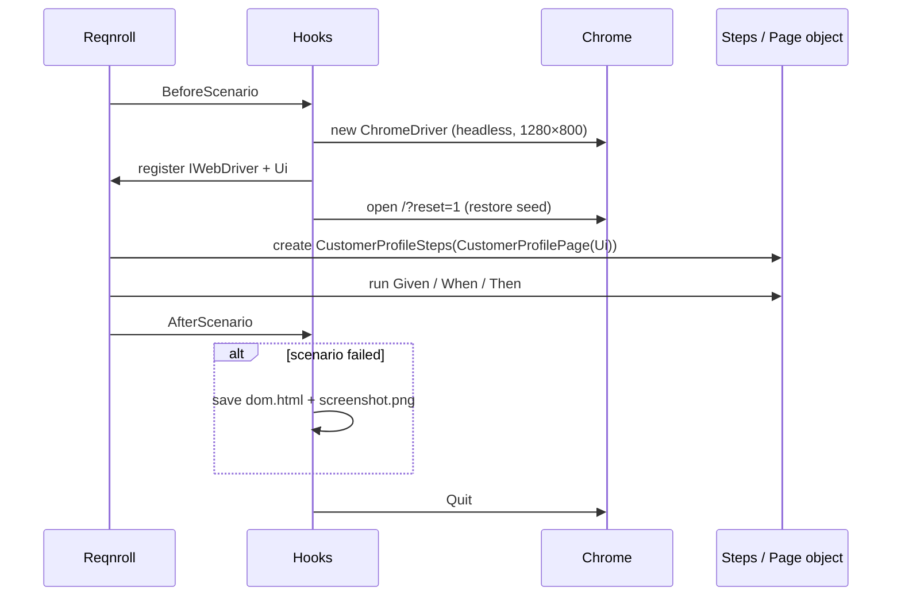

# 08 · Selenium support code

**Goal:** the reusable plumbing every page object uses. `Ui` has correct waits and React-safe typing. `Hooks` handles a browser per scenario, test isolation and failure evidence.

**You'll create:** `tests/Support/Ui.cs`, `tests/Support/Hooks.cs`

Neither file knows anything about the customer profile. They'd work unchanged for any page.

## 8.1 `Ui.cs`: generic browser actions

**File:** `tests/Support/Ui.cs`
```csharp
using OpenQA.Selenium;
using OpenQA.Selenium.Support.UI;

namespace CustomerPortal.Specs.Support;

/// <summary>
/// Generic, component-agnostic browser actions. Every wait targets an observable
/// condition; there are no sleeps. Page objects compose these with generated locators.
/// </summary>
public sealed class Ui(IWebDriver driver)
{
    private readonly WebDriverWait _wait = CreateWait(driver);

    private static WebDriverWait CreateWait(IWebDriver driver)
    {
        var wait = new WebDriverWait(driver, TestSettings.Timeout);
        // React re-renders can replace an element between lookup and use; overlays can briefly intercept clicks.
        wait.IgnoreExceptionTypes(typeof(StaleElementReferenceException), typeof(ElementClickInterceptedException));
        return wait;
    }

    public IWebDriver Driver => driver;

    public void Open(string route) => driver.Navigate().GoToUrl(new Uri(TestSettings.BaseUrl, route));

    public void Reload() => driver.Navigate().Refresh();

    public IWebElement Visible(By by) => Until<IWebElement?>(d =>
    {
        var e = d.FindElements(by).FirstOrDefault();
        return e is { Displayed: true } ? e : null;
    }, $"{by} to be visible")!;

    public void Hidden(By by) => Until(d => d.FindElements(by).All(e => !SafeDisplayed(e)), $"{by} to be hidden");

    public void Click(By by) => Until(_ =>
    {
        var e = Visible(by);
        if (!e.Enabled) return false;
        e.Click();
        return true;
    }, $"{by} to be clickable");

    /// <summary>
    /// Replace an input's value. IWebElement.Clear() does not raise React's onChange,
    /// so select-all + delete is used to keep controlled components in sync.
    /// </summary>
    public void Fill(By by, string text)
    {
        var e = Visible(by);
        e.Click();
        var selectAll = OperatingSystem.IsMacOS() ? Keys.Command : Keys.Control;
        e.SendKeys(selectAll + "a");
        e.SendKeys(Keys.Delete);
        if (text.Length > 0) e.SendKeys(text);
        Until(_ => e.GetDomProperty("value") == text, $"{by} value to be \"{text}\"");
    }

    /// <summary>Click the item of a repeated element whose visible name matches exactly.</summary>
    public void ClickByName(By repeated, string name) => Until(d =>
    {
        var match = d.FindElements(repeated).FirstOrDefault(e => SafeDisplayed(e) && Normalize(e.Text) == name);
        if (match is null) return false;
        match.Click();
        return true;
    }, $"{repeated} named \"{name}\"");

    public string Text(By by) => Normalize(Visible(by).Text);

    public string Value(By by) => Visible(by).GetDomProperty("value") ?? "";

    /// <summary>Wait until the element's text equals the expected value, then return it.</summary>
    public string TextEventually(By by, string expected)
    {
        string actual = "";
        try
        {
            Until(_ => (actual = Text(by)) == expected, $"{by} text to be \"{expected}\"");
        }
        catch (WebDriverTimeoutException) { }
        return actual;
    }

    public string ValueEventually(By by, string expected)
    {
        string actual = "";
        try
        {
            Until(_ => (actual = Value(by)) == expected, $"{by} value to be \"{expected}\"");
        }
        catch (WebDriverTimeoutException) { }
        return actual;
    }

    private T Until<T>(Func<IWebDriver, T> condition, string description)
    {
        _wait.Message = $"Timed out waiting for {description}";
        return _wait.Until(condition);
    }

    private static bool SafeDisplayed(IWebElement e)
    {
        try { return e.Displayed; }
        catch (StaleElementReferenceException) { return false; }
    }

    private static string Normalize(string s) => string.Join(' ', s.Split((char[]?)null, StringSplitOptions.RemoveEmptyEntries));
}
```

### The methods and the recipe words they match

| Recipe says | `Ui` method | How it waits |
|---|---|---|
| (open route) | `Open(route)` | — |
| reload the page | `Reload()` | — (follow it with `Visible(Page)`) |
| wait until X is visible | `Visible(by)` | Polls until the first match is displayed. |
| wait until X is hidden | `Hidden(by)` | Polls until **no** match is displayed. An empty list counts as hidden. |
| click X | `Click(by)` | Waits until visible **and** enabled, then clicks. It retries if an overlay intercepts the click. |
| fill X with "…" / clear X | `Fill(by, text)` | Select-all + delete + type, then waits until the DOM value equals `text`. |
| click `XOption("NZ")` (repeated) | `ClickByName(xs, name)` | Polls the repeated items for the one whose visible text **equals** `name`. |
| assert X text=… | `TextEventually(by, expected)` | Polls until equal. **Returns the actual value either way.** |
| assert X value=… | `ValueEventually(by, expected)` | Same, for input values. |

### Three Selenium problems this class solves

1. **No sleeps, only observable waits.** Every method polls a condition through `WebDriverWait` (up to `TestSettings.Timeout`, 10 s). The fake 300 ms latency in the app proves this works: a sleep-free test that doesn't wait correctly fails immediately.
2. **Stale elements and intercepted clicks.** React may replace a DOM node between "find" and "click", which throws `StaleElementReferenceException`. Ignoring those two exceptions inside the wait means "try again" instead of "fail".
3. **`Clear()` doesn't work on React inputs.** Selenium's `Clear()` sets the DOM value directly, and React's `onChange` never fires. React then puts the old value back on the next render. `Fill` uses keyboard events (⌘/Ctrl+A, Delete, type), which React does see.

### Why `…Eventually` returns the value instead of asserting

```csharp
Assert.That(profile.ConfirmationMessage("Profile saved"), Is.EqualTo("Profile saved"));
```

The wait gives the UI time to reach the expected value. If it never does, the method returns **what was actually there**, and NUnit prints a clear message:

```
Expected: "Profile saved"
But was:  "Saving…"
```

Asserting inside `Ui` would only give "Timed out waiting for …". The pattern keeps the real assertion in the step definition, where a reviewer expects it.

## 8.2 `Hooks.cs`: one browser per scenario

**File:** `tests/Support/Hooks.cs`
```csharp
using NUnit.Framework;
using OpenQA.Selenium;
using OpenQA.Selenium.Chrome;
using Reqnroll;
using Reqnroll.BoDi;

namespace CustomerPortal.Specs.Support;

[Binding]
public sealed class Hooks(IObjectContainer container, ScenarioContext scenario)
{
    private static readonly string ArtifactsDir = Path.Combine(AppContext.BaseDirectory, "artifacts");

    [BeforeScenario(Order = 0)]
    public void StartBrowser()
    {
        var options = new ChromeOptions();
        if (TestSettings.Headless) options.AddArgument("--headless=new");
        options.AddArgument("--window-size=1280,800");
        // Selenium Manager resolves a chromedriver matching the installed Chrome.
        var driver = new ChromeDriver(options);
        container.RegisterInstanceAs<IWebDriver>(driver);
        container.RegisterInstanceAs(new Ui(driver));

        // Test isolation: restore the shared seed (web/src/api/seed.ts).
        driver.Navigate().GoToUrl(new Uri(TestSettings.BaseUrl, "/?reset=1"));
    }

    [AfterScenario]
    public void StopBrowser()
    {
        var driver = container.Resolve<IWebDriver>();
        try
        {
            if (scenario.TestError is not null) SaveEvidence(driver);
        }
        finally
        {
            driver.Quit();
        }
    }

    /// <summary>Same evidence shape as the web contracts, so a failure can be diffed against the expected state.</summary>
    private void SaveEvidence(IWebDriver driver)
    {
        var name = string.Concat(scenario.ScenarioInfo.Title.Split(Path.GetInvalidFileNameChars()));
        var dir = Path.Combine(ArtifactsDir, $"{DateTime.UtcNow:yyyyMMddTHHmmss}-{name}");
        Directory.CreateDirectory(dir);
        File.WriteAllText(Path.Combine(dir, "dom.html"), driver.PageSource);
        ((ITakesScreenshot)driver).GetScreenshot().SaveAsFile(Path.Combine(dir, "screenshot.png"));
        TestContext.AddTestAttachment(Path.Combine(dir, "screenshot.png"));
        TestContext.Progress.WriteLine($"Failure evidence: {dir}");
    }
}
```

### Reqnroll concepts used here

| Concept | Meaning |
|---|---|
| `[Binding]` | Tells Reqnroll that this class contains hooks or step definitions. |
| `[BeforeScenario]` / `[AfterScenario]` | Run around **each** scenario, including each Examples row. `Order = 0` makes this run before any other BeforeScenario hooks. |
| `IObjectContainer` | Reqnroll's per-scenario **dependency injection** container. Anything registered here can be a constructor parameter of step classes and page objects. |
| `ScenarioContext` | Information about the running scenario: title, tags, and `TestError` if it failed. |
| Primary constructor `Hooks(…)` | C# 12 syntax. The parameters are injected by the container. |

### What happens for each scenario



- **Fresh browser per scenario** means no leftover cookies, `localStorage` or open popups. It costs about a second per scenario and removes a whole class of flaky tests.
- **`/?reset=1`** runs the reset hook you wrote in `main.tsx` (chapter 02).
- **Window 1280 × 800** matches the Vitest viewport (chapter 03), so the same layout means the same visibility.
- **Failure evidence**: `dom.html` has the same kind of content as a contract state file. When "after reloading my country is United Kingdom" fails, you can diff `bin/Debug/net8.0/artifacts/…/dom.html` against `web/contracts/customer-profile.change-country/05-reloaded.html` and see what differs.

## ✅ Checkpoint

```bash
(cd tests && dotnet build)
```

The build succeeds with 0 errors.

Now run the tests **without** the app running:

```bash
(cd tests && dotnet test)
```

```
Failed!  - Failed:     4, Passed:     0, Skipped:     0, Total:     4
  … OpenQA.Selenium.UnknownErrorException : unknown error: net::ERR_CONNECTION_REFUSED
```

That's expected. The `BeforeScenario` hook now starts Chrome and opens `http://localhost:8080/?reset=1`, and nothing is listening yet. Look in `tests/bin/Debug/net8.0/artifacts/`: the failure-evidence code has already saved a `dom.html` and `screenshot.png` per scenario.

Now start the app in a second terminal (`cd learn/workspace/web && npm start`) and run again:

```bash
(cd tests && dotnet test)
```

All four are **skipped** again (there are no step definitions yet), and each takes about 0.7 s, because a real Chrome starts and stops per scenario. Stop the app with `Ctrl+C`.

Next: [09 · Page objects and step definitions](09-page-objects-and-steps.md)
