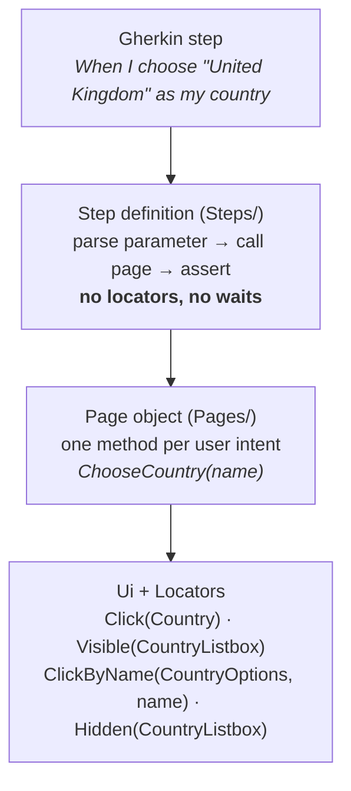

# 09 · Page objects and step definitions

**Goal:** connect the Gherkin sentences to the recipes. First you'll do it **by hand**, so you know exactly what the AI agent does. Then you'll set up the `bind-steps` skill so an agent can do it next time.

**You'll create:** `tests/Pages/CustomerProfilePage.cs`, `tests/Steps/CustomerProfileSteps.cs`, `.claude/skills/bind-steps/SKILL.md`

## 9.1 Three layers, three jobs



| Layer | Knows about | Changes when |
|---|---|---|
| Step definition | Business sentences, NUnit asserts | The wording of the spec changes |
| Page object | User intents, and the order of actions and waits (from recipes) | The interaction changes (dropdown → radio buttons) |
| `Ui` + generated locators | Selenium mechanics and test IDs | Never by hand (`Ui` is generic, locators are generated) |

## 9.2 Map every step to a recipe slice

This is the thinking the agent does. Take the recipes from chapter 07 and cut them into pieces that match the Gherkin steps:

| Gherkin step | Recipe slice (flow, step numbers) | Page-object method |
|---|---|---|
| Given I am on my customer profile | every flow, 1 `wait until Page is visible` (after opening `Route`) | `Open()` |
| When I change my full name to "…" | update-full-name 3 `fill FullName` | `SetFullName(name)` |
| When I clear my full name | full-name-required 3 `clear FullName` | `ClearFullName()` |
| When I choose "…" as my country | change-country 3–7: click `Country`, wait `CountryListbox` visible, click option, wait `CountryListbox` hidden | `ChooseCountry(name)` |
| And I save my profile | every flow: click `Save` | `Save()` |
| Then I see the confirmation "…" | wait `Toast` visible + **assert** `Toast` text (update-full-name 5, 7; change-country 11, 13) | `ConfirmationMessage(expected)` |
| Then I see the error "…" | full-name-required 5 wait `FullNameError` visible + 7 **assert** `FullNameError` text | `FullNameError(expected)` |
| after reloading … full name is "…" | 8 reload, 9 wait `Page`, 11 **assert** `FullName` **value** | `Reload()` + `FullName(expected)` |
| after reloading … country is "…" | 14 reload, 15 wait `Page`, 17 **assert** `Country` **text** | `Reload()` + `Country(expected)` |

Three decisions to notice:

1. **`Save()` doesn't wait for anything.** What follows a save depends on the scenario: a toast in AC-101 and AC-102, an error in AC-103. So the wait belongs to the assertion method that comes next.
2. **Value vs text.** The recipe says `FullName value="…"` (an `<input>`), but `Country text="…"` (a button's label). Using the wrong one gives an empty string. The recipe tells you which.
3. **Parameters vs recorded data.** The recipe clicked `CountryOption("NZ")`, but the Scenario Outline also needs "United Kingdom". Selecting by **key** would need a name → key table. Selecting by **accessible name** with `ClickByName(CountryOptions, name)` works for any value in the locator's `Names:` list, and "United Kingdom" is in it. If a scenario ever used "France", that's not a code problem. It's a **test data gap**: France isn't in the seed.

## 9.3 The page object

```bash
mkdir -p tests/Pages tests/Steps
```

**File:** `tests/Pages/CustomerProfilePage.cs`
```csharp
using CustomerPortal.Specs.Generated;
using CustomerPortal.Specs.Support;
using L = CustomerPortal.Specs.Generated.CustomerProfileLocators;

namespace CustomerPortal.Specs.Pages;

/// <summary>
/// User intents on the customer profile page. Each method follows the verified
/// recipe in Generated/CustomerProfile.recipes.md (produced by the bind-steps skill).
/// </summary>
public sealed class CustomerProfilePage(Ui ui)
{
    /// <summary>Recipes: every flow, steps 1–2.</summary>
    public void Open()
    {
        ui.Open(CustomerProfileLocators.Route);
        ui.Visible(L.Page);
    }

    /// <summary>customer-profile.update-full-name, step 3.</summary>
    public void SetFullName(string fullName) => ui.Fill(L.FullName, fullName);

    /// <summary>customer-profile.full-name-required, step 3.</summary>
    public void ClearFullName() => ui.Fill(L.FullName, "");

    /// <summary>
    /// customer-profile.change-country, steps 3–7: open the combobox, wait for the
    /// portaled listbox, pick the option by accessible name, wait for it to close.
    /// </summary>
    public void ChooseCountry(string countryName)
    {
        ui.Click(L.Country);
        ui.Visible(L.CountryListbox);
        ui.ClickByName(L.CountryOptions, countryName);
        ui.Hidden(L.CountryListbox);
    }

    /// <summary>
    /// Every flow: click Save. The wait that follows depends on the outcome
    /// (toast or validation error), so it belongs to the assertion methods.
    /// </summary>
    public void Save() => ui.Click(L.Save);

    /// <summary>Waits for the toast (recipe "wait until Toast is visible") and returns its text.</summary>
    public string ConfirmationMessage(string expected) => ui.TextEventually(L.Toast, expected);

    /// <summary>Waits for the validation alert and returns its text.</summary>
    public string FullNameError(string expected) => ui.TextEventually(L.FullNameError, expected);

    /// <summary>Recipes: "reload the page" + "wait until Page is visible".</summary>
    public void Reload()
    {
        ui.Reload();
        ui.Visible(L.Page);
    }

    public string FullName(string expected) => ui.ValueEventually(L.FullName, expected);

    public string Country(string expected) => ui.TextEventually(L.Country, expected);
}
```

- `using L = …CustomerProfileLocators;` is a short alias that keeps the methods readable.
- Each `<summary>` names the recipe steps it implements, so a reviewer can check it against `recipes.md` line by line.
- Every locator comes from the generated class. There's **no string selector anywhere**.
- The page object gets `Ui` through its constructor. Reqnroll's container creates it for you, because `Hooks` registered `Ui`.

## 9.4 The step definitions

**File:** `tests/Steps/CustomerProfileSteps.cs`
```csharp
using CustomerPortal.Specs.Pages;
using NUnit.Framework;
using Reqnroll;

namespace CustomerPortal.Specs.Steps;

/// <summary>Thin bindings: parse, delegate to the page object, assert the business outcome.</summary>
[Binding]
public sealed class CustomerProfileSteps(CustomerProfilePage profile)
{
    [Given("I am on my customer profile")]
    public void GivenIAmOnMyCustomerProfile() => profile.Open();

    [When("I change my full name to {string}")]
    public void WhenIChangeMyFullNameTo(string fullName) => profile.SetFullName(fullName);

    [When("I clear my full name")]
    public void WhenIClearMyFullName() => profile.ClearFullName();

    [When("I choose {string} as my country")]
    public void WhenIChooseAsMyCountry(string country) => profile.ChooseCountry(country);

    [When("I save my profile")]
    public void WhenISaveMyProfile() => profile.Save();

    [Then("I see the confirmation {string}")]
    public void ThenISeeTheConfirmation(string message) =>
        Assert.That(profile.ConfirmationMessage(message), Is.EqualTo(message));

    [Then("I see the error {string}")]
    public void ThenISeeTheError(string message) =>
        Assert.That(profile.FullNameError(message), Is.EqualTo(message));

    [Then("after reloading the page my full name is {string}")]
    public void ThenAfterReloadingMyFullNameIs(string fullName)
    {
        profile.Reload();
        Assert.That(profile.FullName(fullName), Is.EqualTo(fullName));
    }

    [Then("after reloading the page my country is {string}")]
    public void ThenAfterReloadingMyCountryIs(string country)
    {
        profile.Reload();
        Assert.That(profile.Country(country), Is.EqualTo(country));
    }
}
```

- **Cucumber expressions**: `{string}` matches a quoted value and passes it in without the quotes. `And` steps match `[When]` or `[Then]` according to the keyword they follow.
- **`CustomerProfilePage profile`** is injected. Reqnroll builds it with `Ui` from the container.
- **Assertions are equality**, the same as the recipe's `assert`. Weakening one to `Contains` would let a wrong message pass.

## 9.5 Rules, whether a person or an agent writes this code

- Never edit `.feature` files, `Generated/*` or contracts. If one is wrong, report it.
- Never add `Thread.Sleep`, retries around assertions, `[Ignore]`, a try/catch that swallows failures, or weakened assertions.
- Only use locators from `<Page>Locators`. A missing test ID or a ⚠ warning in a recipe means **stop and ask the developer**.
- Assert the business outcome the scenario states. A click that doesn't throw proves nothing.

## 9.6 Letting an AI agent do this: the `bind-steps` skill

In the team workflow, you don't hand-write 9.3 and 9.4. You ask Claude Code to do it, and then review the result like any PR. The agent's instructions live in a **skill** file inside the workspace:

```bash
mkdir -p .claude/skills/bind-steps
```

**File:** `.claude/skills/bind-steps/SKILL.md`
```markdown
---
name: bind-steps
description: Generate or update Reqnroll step definitions and Selenium page objects for tagged .feature scenarios from the web project's UI contracts. Use when a scenario has undefined/failing steps, when web/contracts changed, or when asked to "bind", "implement steps" or "generate page objects".
---

# Bind Gherkin steps to UI contracts

You turn the tester's scenarios into executable Selenium code **using only facts the web developer verified in a real browser**. Treat the contracts as the source of truth for locators and interaction order, and the `.feature` files as the source of truth for behaviour.

## Inputs (read all before writing)

1. `tests/Features/**/*.feature`: the scenarios and their `@AC-nnn` tags. **Read-only.**
2. `tests/Generated/<Page>.recipes.md`: the verified interaction recipe for each flow, keyed by the same `@AC-nnn`.
3. `tests/Generated/<Page>Locators.g.cs`: the only allowed locators. **Read-only.** It is regenerated by `npm run locators` in `web/` (`web/tools/generate-locators`).
4. `web/contracts/<flow>/*.html`: the rendered HTML per state. Open these when a recipe step is ambiguous, for example when you're unsure what a popup contains.
5. `tests/Support/Ui.cs`: generic actions (`Open`, `Click`, `Fill`, `ClickByName`, `Visible`, `Hidden`, `Reload`, `TextEventually`, `ValueEventually`).
6. Existing `tests/Pages/*.cs` and `tests/Steps/*.cs`: reuse and extend these; never duplicate.

## Process

1. Refresh generated inputs: `npm run locators` (run from `web/`). If it reports an AC without a contract, **stop** and report the missing flow to the web developer. Do not invent locators.
2. For each scenario, find its recipe by tag. Map every Gherkin step to a slice of the recipe:
   - `Given`: open the route and wait for the recipe's first `wait until … visible`.
   - `When`/`And` (action): the recipe's actions **plus the waits that follow them**, in order.
   - `Then`/`And` (assertion): the recipe's `assert` step. Use the same locator and the same property (text vs value vs checked).
   - "after reloading": the recipe's `reload` + `wait` + `assert`.
3. Put interaction sequences in the page object (`tests/Pages/<Page>Page.cs`), one intention-revealing method per user intent (for example `ChooseCountry(name)`, not `ClickCountry` + `ClickOption`). A multi-step control such as a combobox (open, wait for the portal listbox, pick the option, wait until hidden) becomes one method.
4. Keep step definitions thin (`tests/Steps/<Page>Steps.cs`): parse parameters, call the page object, assert with NUnit `Assert.That`. A step definition must never contain locators or waits.
5. **Parameters vs recorded data.** A recipe records one concrete example, such as the option `NZ` "New Zealand". Scenario outlines pass other values. Select repeated items by the **accessible name** the step supplies (`Ui.ClickByName(Locators.XOptions, name)`) unless the step speaks in business keys. Check that the value exists in the contract's `Names:` list. If it doesn't, flag a test-data gap rather than guessing.
6. Build and run from `tests/`: `dotnet build`, then `dotnet test --filter "Category=AC-nnn"` with the web app running (`npm start` in `web/`). Iterate on failures using `bin/**/artifacts/*/dom.html` against the contract HTML of the same state.

## Rules

- Never edit `.feature` files, `Generated/*`, or contracts. If one of them is wrong, report it.
- Never add `Thread.Sleep`, retries around assertions, `[Ignore]`, try/catch that swallows failures, or weakened assertions (for example `Contains` where the recipe asserts equality).
- Only use locators from `<Page>Locators`. If an element you need has no `data-testid`, or the recipe shows a ⚠ warning, stop and request a testid from the web developer.
- Portal elements (marked `PORTAL` in the locator docs) are searched from the document root. This is already true for `By` locators; don't scope them under the trigger.
- Assertions must check the business outcome the scenario states. A click that succeeds proves nothing.

## Output report

For each scenario: tag, recipe used, step → method mapping, files changed, and the build/test commands you ran with their results. List any gaps: missing contract, missing testid, a value not in the fixture, or an ambiguous step.
```

It's the same thinking as 9.2–9.5, written as instructions. To use it, start Claude Code **from `learn/workspace/`** (skills are found under `.claude/skills` of the folder you start in) and ask:

```
use bind-steps for @AC-102
```

You'll try this for real in chapter 12.

## ✅ Checkpoint

```bash
(cd tests && dotnet build)
```

The build succeeds. The steps are bound now, but running them needs the app. That's the next chapter.

Next: [10 · Run everything](10-run-everything.md)
