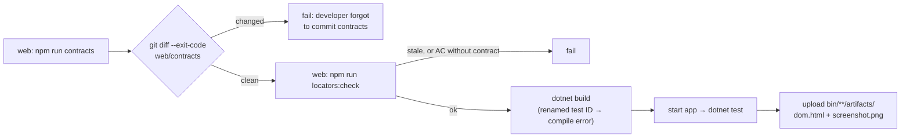

# 10 · Run everything

**Goal:** run the E2E suite against the real app, watch it, filter it, script the whole loop, and see how it would run in CI.

**You'll create:** `run-e2e.sh`

## 10.1 Manually, in two terminals

**Terminal 1 (new): the app.** Open a second terminal at the repository root:

```bash
cd learn/workspace/web
npm start
```

Wait for `compiled successfully`. Leave it running.

**Terminal 2 (your usual one, in `learn/workspace`): the tests**

```bash
(cd tests && dotnet test)
```

The first run may take longer while Selenium Manager downloads chromedriver. Expected:

```
Passed!  - Failed:     0, Passed:     4, Skipped:     0, Total:     4
```

Four tests: AC-101, AC-102 × 2 (New Zealand and United Kingdom), and AC-103.

## 10.2 Useful variations

```bash
cd tests
HEADED=1 dotnet test                                   # watch Chrome do it
dotnet test --filter Category=AC-102                   # one acceptance criterion (both rows)
dotnet test --filter "Category=AC-101|Category=AC-103" # several
dotnet test --logger "console;verbosity=detailed"      # see each Given/When/Then as it runs
cd ..                                                  # back to learn/workspace
```

To run the app on another port, stop it in terminal 1 and start it there with `npm start -- --port 9090` (the `--` passes the option through to webpack-dev-server), then point the tests at it:

```bash
(cd tests && WEB_BASE_URL=http://localhost:9090 dotnet test)
```

With `HEADED=1 --filter Category=AC-102`, watch closely. The listbox opens, the test **waits** for it, clicks "United Kingdom", **waits** for it to close, saves, **waits** for the toast, reloads, and checks. Every wait you see was in the recipe.

## 10.3 One script for the whole loop

**File:** `run-e2e.sh`
```bash
#!/usr/bin/env bash
# One-shot local pipeline: contracts -> generated locators -> E2E against the running app.
set -euo pipefail
cd "$(dirname "$0")"

echo "== 1. Web: record UI contracts (Vitest browser mode, real Chrome)"
(cd web && npm run --silent contracts)

echo "== 2. Regenerate locators + recipes for tests/, check AC coverage"
(cd web && npm run --silent locators)

echo "== 3. Start web app (webpack dev server) if not already running"
BASE_URL="${WEB_BASE_URL:-http://localhost:8080}"
STARTED=""
if ! curl -fs "$BASE_URL" >/dev/null; then
  (cd web && npx webpack serve --mode development >/tmp/sample-web.log 2>&1) &
  STARTED=$!
  trap '[ -n "$STARTED" ] && pkill -P "$STARTED" 2>/dev/null; kill "$STARTED" 2>/dev/null || true' EXIT
  for _ in $(seq 1 60); do curl -fs "$BASE_URL" >/dev/null && break; sleep 1; done
fi

echo "== 4. Reqnroll + Selenium E2E"
(cd tests && dotnet test "$@")
```

| Line | Why |
|---|---|
| `set -euo pipefail` | Stop at the first failing command. A failing flow test must stop the pipeline before E2E. |
| `cd "$(dirname "$0")"` | Works from any current directory. |
| Step 2 | `npm run --silent` hides npm's header lines. The generator exits with 1 if a tagged AC has no contract, which stops the script. |
| Step 3 | Reuses a running dev server, or starts one in the background and stops it on exit (`trap … EXIT`). The loop waits up to 60 s for the server to answer. A server it starts itself is always on port 8080, so set `WEB_BASE_URL` only for an app you've already started elsewhere. |
| `"$@"` | Extra arguments go to `dotnet test`: `./run-e2e.sh --filter Category=AC-102`. |

Stop the dev server from 10.1 first (so the script starts and stops its own), then:

```bash
chmod +x run-e2e.sh
./run-e2e.sh
```

## 10.4 How this runs in CI



Each gate catches a different mistake **as early as possible, next to its cause**:

| Gate | Catches |
|---|---|
| Contracts diff | The UI changed but the committed contracts didn't. |
| `locators:check` | Contracts changed but nobody regenerated, or the tester wrote an AC the developer hasn't covered. |
| `dotnet build` | A test ID was renamed or removed. The generated member disappears, so the page object doesn't compile. |
| `dotnet test` | Real behaviour: persistence, validation, waits. |

You'll trigger most of these on purpose in chapter 11.

## ✅ Checkpoint

`./run-e2e.sh` ends with:

```
Passed!  - Failed:     0, Passed:     4, Skipped:     0, Total:     4
```

**You've rebuilt the whole sample.** Compare your workspace with it:

```bash
diff -r web/src ../../sample/web/src
diff -r web/contracts ../../sample/web/contracts
diff -r web/tools ../../sample/web/tools
diff -r tests/Generated ../../sample/tests/Generated
for d in Support Pages Steps Features; do diff -r tests/$d ../../sample/tests/$d -x '*.feature.cs'; done
```

The `diff` commands should print nothing. The one intended difference is `web/package.json`: you pinned exact versions, and the sample uses `^` ranges.

Next: [11 · Break it on purpose](11-break-it-on-purpose.md)
