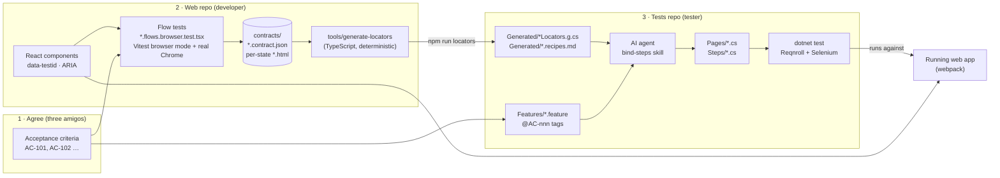
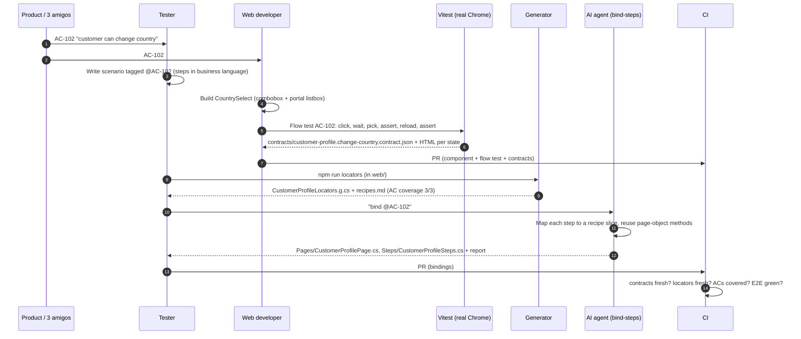
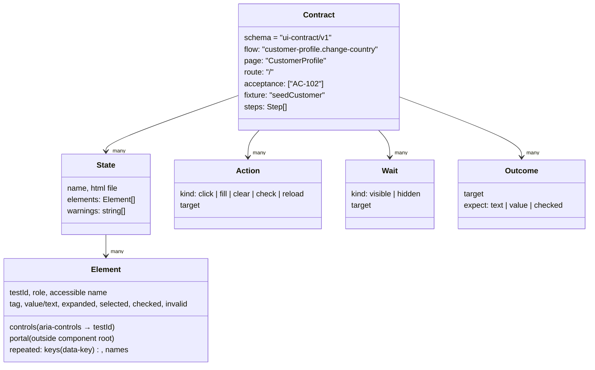
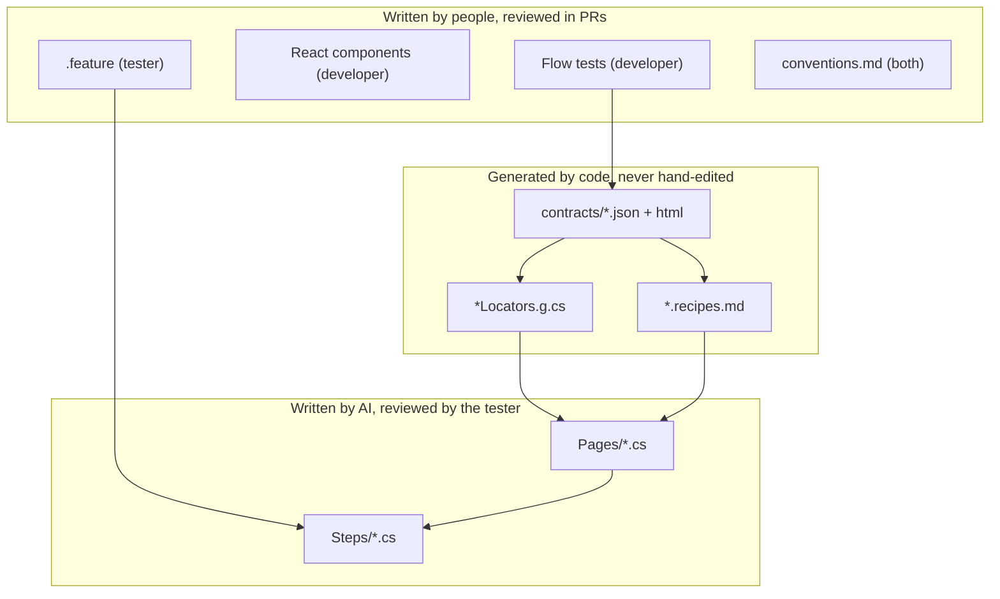
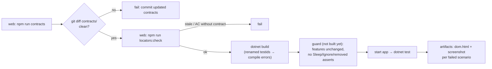

# Contract-driven BDD: a web developer and a tester pairing through UI contracts

## 1. The idea in one paragraph

The developer and the tester agree on the same acceptance criteria (ACs). The tester writes them as Reqnroll `.feature` scenarios. The developer builds the React components and, for each AC, writes a small **flow test** that drives the real component in a real browser. As it runs, the flow test records what the UI looked like and how it was operated. The recording is written as **UI contract** files. The test repository turns those contracts into Selenium locators (by code) and step bindings (by an AI agent). Nobody guesses a selector, and nobody translates an old locator.

## 2. What changed from the first idea, and why

| Initial assumption | Refinement | Why |
|---|---|---|
| "Components generate snapshots (HTML)" | Flows record **state → action → wait → state → outcome**, plus the HTML of each state | A single snapshot can't show a popup that only exists after a click, a wait condition, or what a `Then` should assert. Transitions are the hard part of UI automation. |
| "AI generates locators from the HTML" | **Locators are generated deterministically**. AI only maps Gherkin sentences to recorded flows | Locators are facts, and a script reproduces them exactly every time. AI is good at the *semantic* mapping ("choose country" → open combobox, pick option, wait for close) and bad at being reproducible. |
| One snapshot per component | One flow **per acceptance criterion**, linked by an `@AC-nnn` tag on both sides | Without a shared key, the agent has to guess which snapshot belongs to which scenario. |
| Snapshots are a by-product | Contracts are **committed, reviewed and checked in CI** | They are the interface between two people. Changing one is an API change. |

## 3. Big picture

## 4. How one acceptance criterion flows through the team

The developer and the tester can work **in parallel** until step 8. Only binding waits for a contract. If the tester is ahead, the generator reports `AC-nnn has no UI contract`. That is a to-do for the developer, not a failure the tester works around.

## 5. What a contract contains

The recorder (`web/src/testing/uiContract.ts`) also **warns** when an interactive element has no `data-testid`, or when repeated items have no `data-key`. Those warnings show up in the recipes, and the agent is told to stop on them.

## 6. Who owns what, and how much each artifact is trusted

The rule of thumb: **facts are generated, intent is written, glue is AI-assisted and human-reviewed.**

## 7. Gap analysis: what the original idea was missing

Status: ✅ closed in the sample · 🟡 partly addressed · 🔴 open, needs a team decision.

| # | Gap | Why it matters | Status and how |
|---|---|---|---|
| 1 | **Transitions, not just snapshots** | Dropdown options, dialogs and toasts exist only after an action. A static snapshot can't produce a wait condition. | ✅ The flow recorder writes actions, waits and outcomes between states. |
| 2 | **Traceability scenario ↔ snapshot** | Otherwise the agent guesses which snapshot belongs to which step. | ✅ `@AC-nnn` tag in the feature file = `acceptance` in the contract. The generator reports coverage. |
| 3 | **Determinism of locators** | AI output varies between runs, so reviews and diffs would be noisy. | ✅ The TypeScript generator (`web/tools/generate-locators`), which reuses the recorder's contract types. AI never writes a selector. |
| 4 | **Portals** | The listbox renders into `<body>`, so a locator scoped under the trigger finds nothing. | ✅ `portal: true` in the contract, `PORTAL` in the locator docs, and a skill rule. |
| 5 | **Repeated elements / business identity** | Five options share one testid. Which one is "New Zealand"? | ✅ `data-key` convention, `repeated.keys/names` in the contract, `Option(key)` and `ClickByName`. |
| 6 | **Shared test data** | Accessible names in contracts ("Aroha Smith", "Australia") must match what E2E sees. | ✅ in the sample: one `seed.ts` used by both flow tests and `/?reset=1`. 🔴 in real systems: you need a backend seeding API or fixtures that both sides use. |
| 7 | **Parameterised scenarios** | A flow records one example (NZ). Scenario outlines use others (United Kingdom). | 🟡 The skill selects by name and checks the value is in the contract's `Names` list. Values outside the fixture are reported as data gaps. |
| 8 | **Drift after UI changes** | A renamed testid breaks E2E later and far from the cause. | ✅ Contracts are committed. `npm run locators:check` fails when outputs are stale. A renamed member becomes a **C# compile error**, not a runtime flake. (Verified by renaming `profile-save`.) |
| 9 | **Selenium ≠ Vitest/Playwright behaviour** | `Clear()` doesn't raise React `onChange`, stale elements appear after re-render, clicks get intercepted by overlays. | ✅ `Support/Ui.cs`: select-all + delete, waits that ignore stale elements, observable waits only. |
| 10 | **Assertions proving business outcomes** | "Clicked Save without error" isn't an acceptance test. | ✅ Recipes contain `assert` steps. Persistence is checked by reload. (Verified: breaking persistence makes AC-101/102 fail with the expected vs actual values.) |
| 11 | **Isolation vs integration** | Flow tests render the page with a fake API. They don't exercise routing, auth, real backend, CORS or feature flags. | 🔴 E2E stays the integration check. For multi-page apps, add `route` + auth preconditions to the contract and record flows at page level with MSW (Mock Service Worker, which intercepts API calls in the browser). |
| 12 | **Two repositories** | The sample reads `../web/contracts`. Separate repos need a hand-off. | 🔴 Publish contracts, together with the generator, as a versioned artifact (npm package or CI artifact) and pin the version in the tests repo. `schema: ui-contract/v1` is already there for this. |
| 13 | **Who goes first** | If the feature is written after the UI, it drifts toward UI wording. If long before, contracts don't exist yet. | 🟡 Process: agree the AC IDs and step vocabulary first (§8). The tester writes scenarios and the developer writes flows in parallel. Binding happens last. |
| 14 | **Step vocabulary and reuse** | "I save my profile" vs "I click Save" leads to duplicate bindings. | 🔴 Keep a small glossary of domain verbs. The skill already prefers extending existing page methods. |
| 15 | **AI patch safety** | An agent can "fix" a red test by weakening it. | 🟡 Skill rules and human review of bindings. A CI guard (feature files unchanged, no Sleep/Ignore, no removed asserts) is **not built yet**; see §9. |
| 16 | **Non-UI outcomes** | Emails, audit logs and DB state aren't in any snapshot. | 🔴 Out of scope for UI contracts. Bind to API or DB helpers explicitly. |
| 17 | **Visual and layout regressions** | Contracts strip styles on purpose. | 🔴 Add screenshot comparison separately if needed (Vitest `toMatchScreenshot`). |
| 18 | **Sensitive data in HTML snapshots** | Contracts get committed and shared. | 🟡 Use synthetic fixtures only. Never record flows against real accounts. |
| 19 | **Accessibility as a side effect** | Roles and names come from the real accessibility computation. | ✅ bonus: missing names and testids show up as warnings. Using role- and name-based waits also nudges the UI toward correct ARIA. |
| 20 | **Environment** | You're on macOS. CI is usually Linux. | ✅ Both runners use the installed Chrome (Playwright `channel: 'chrome'`, Selenium Manager). On Linux CI, install Chrome or switch the Vitest provider to Playwright's Chromium. |

## 8. Working agreement (the part that isn't code)

1. **AC IDs first.** Every agreed AC gets an ID before anyone writes code. Both sides use it.
2. **Testids are part of the component API.** Naming, `data-key` and portal rules are in `conventions.md`. Renaming one is a breaking change: regenerate, fix the compile errors, and mention it in the PR.
3. **Flow per AC, written by the developer.** It's also the developer's fast regression test (it runs in about 3 s).
4. **Scenarios in business language, written by the tester.** No UI words ("click", "dropdown") in steps.
5. **Contract review is shared.** Contract diffs in a web PR are how the tester learns about UI changes. A tester review is requested when a contract changes.
6. **The AI agent binds and the tester reviews.** Bindings go through a normal PR. Nobody hand-edits generated files.

## 9. Pipeline

## 10. Suggested next steps

1. Run the sample (`sample/run-e2e.sh`) and walk through one AC together, developer and tester.
2. Pick one real page with a non-trivial control (autocomplete, date picker, or a virtualised grid). Add a flow and see which gaps from §7 bite first.
3. Decide on gap 12 (how contracts move between repos) and gap 6 (backend seeding) before scaling.
4. Wire §9 into CI, and write the AI-safety guard it needs (gap 15).
